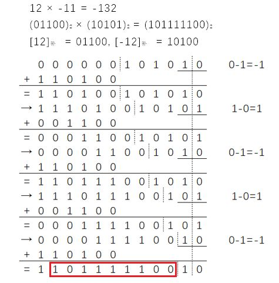
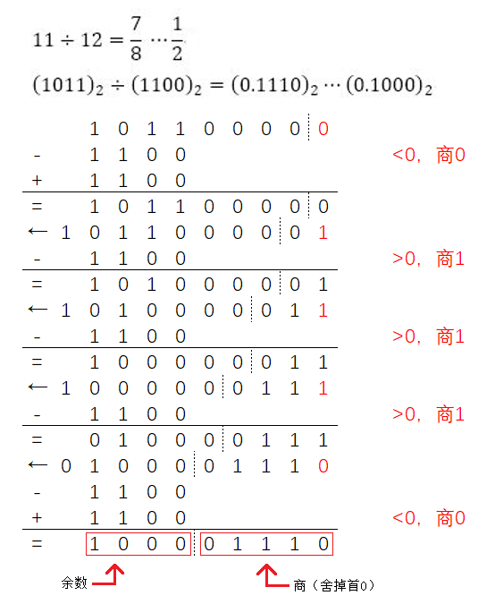
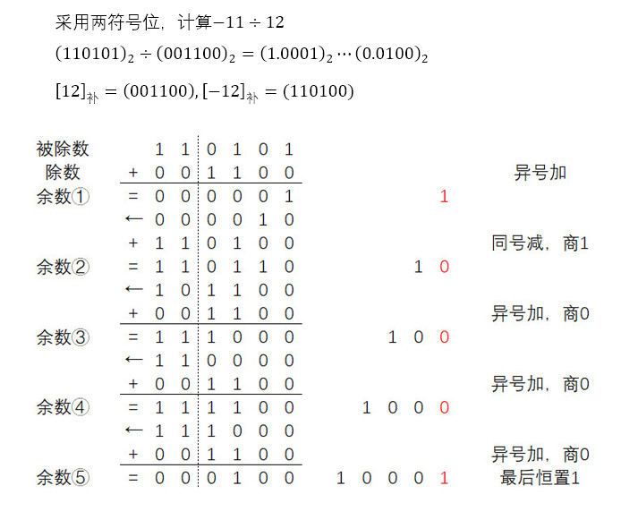
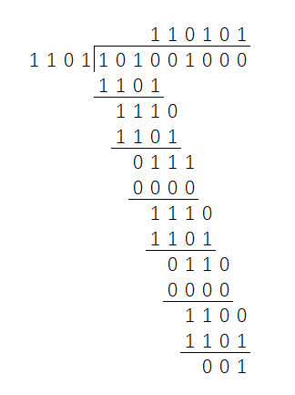

# 二、数据表示与运算

数的表示分为定点数和浮点数，其真值是机器数表示的**实际值**。还可分为无符号数和有符号数，无符号数的全部二进制位均为数值位；有符号数有符号位，一般符号位“1”表示负号，“0”表示正号。

## 1. 定点数

### 1）有符号整数表示

设字长为$n+1$，符号位 1 位，数值位$n$位。

定点整数的结构为 $x_s x_1 x_2 \cdots x_n$。

定点小数为纯小数，结构为 $x_s 0 .x_1 x_2 \cdots x_n$，即只有小数部分，整数部分为 0。定点小数的数值部分又被称为尾数。

**二进制原码**

最高位为符号位，数值位是真值的绝对值。

- 定点整数表示范围为$-(2^n - 1) \le x \le 2^n -1$ ；

  定点小数表示范围为$-(1-2^{-n}) \le x \le (1-2^{-n})$ 。

- 有正零和负零两种形式。

- 原码的加法：（1）符号相同，则绝对值相加，符号位不变（2）符号不同，绝对值大的数减去绝对值小的数，符号位与绝对值大的数相同；

  原码的减法：减数符号取反，后做加法。

  进位导致左边溢出时应丢弃。

**二进制补码**

最高位为符号位，数值位：（1）正数、零等于真值（2）整数负数等于（$2^{n+1} -$真值绝对值），小数负数等于（$2-$真值绝对值）。

- 求一个负数的补码，可以将其**数值位取反加一**，符号位不变；

  求一个补码表示的负数，可以**将数值位取反加一**，符号位表示符号。

- 定点整数表示范围为$-2^n \le x \le 2^n -1$ ；

  定点小数表示范围为$-1 \le x \le 1-2^{-n}$ 。

- 补码表示下零值的编码是唯一的。

- 使用补码情况下两个数的加法、减法与数学的二进制加减法规则相同，计算过程中连同符号位一起运算，结果就是所求补码。但是在减法过程中避免了**借位**，降低了硬件实现的难度。

- 将补码的符号位和数值位一起右移一位并用符号位填充，可以实现除 2。

**二进制反码**

最高位为符号位，数值位：（1）正数、零等于真值（2）负数、负零等于（$2^{n+1} - 1 -$真值绝对值），非正小数等于（$2 - 2^{-n} -$真值绝对值）。

- 定点整数表示范围为$-(2^n - 1) \le x \le 2^n - 1$ ；

  定点小数表示范围为$-(1-2^{-n}) \le x \le 1 - 2^{-n}$ 。

- 反码表示下有正零和负零两种形式。

- 求一个负数的反码，可以将其**数值位取反**，符号位不变。

**二进制移码**

移码只能用于整数。

最高位可以当做符号位，但是负号为 0，正号为 1；全部都可以作为数值位，为（真值$+2^n$）。

- 表示范围为$-2^n \le x \le 2^n - 1$。
- 移码表示只有一个零。
- 一个真值的**移码和补码仅差一个符号位**，可以用此方法来求移码。

### 2）移位运算

**算术移位**

算术移位的对象是有符号数，移位过程中符号位保持不变。

- 对于正数，算术移位后的空位均填 0；
- 对于负数原码，算术移位后的空位填 0。若不产生溢出，左移相当于乘以 2，右移相当于除以 2；
- 对于负数补码，算术左移后填 0，算术右移后填 1；
- 对于负数反码，算术移位后的空位填 1。

**逻辑移位**

逻辑移位将操作数作为无符号数看待，左右移均填 0。

**循环移位**

- 带有进位标志位的大循环
- 不带有进位标志位的小循环

### 3）符号扩展

如果需要将一个有符号数扩展到更长的位数时，需要进行符号扩展。

- 正数的符号扩展是将符号位 0 移动到最高位，其它空位填 0。
- 负数原码的符号扩展是将符号位 1 移动到最高位，其它空位填 0。
- 负数补码的符号扩展是将符号位 1 移动到最高位，整数其它空位填 1，小数其它空位填 0。
- 负数反码的符号扩展是将符号位移动到最高位，其它空位填 1。

除了符号扩展之外还有**零扩展**。

### 4）溢出判别

大于机器能够表示的最大正数为上溢，小于机器能够表示的最小负数为下溢。因多使用补码，对于**有符号数补码**的加减运算溢出的判断方法如下：

- 设数$A$的符号位为$A_S$，数$B$的符号位为$B_S$，运算结果的符号位为$S_S$，则溢出的表达式为$V = A_S B_S \overline{S_S} + \overline{A_S} \overline{B_S} S_S$。若$V = 0$，则无溢出；若$V = 1$，则有溢出。
- 设符号位的进位为$C_S$，最高数值位的进位为$C_1$。若$C_S$与$C_1$相同，则无溢出；若不相同，则有溢出。
- 采用双符号位时，00 为负，11 为正。运算结果的两个符号位若相同，则无溢出；若不相同，则有溢出。

### 5）乘除法

**原码一位乘法**

以计算原码表示下的$x_s x_1 x_2 \cdots x_n \times \ y_s y_1 y_2 \cdots y_n$的乘积为例，（定点整数与定点小数相同）

1.  乘积的符号位：$m_s = x_s \ \ \mathrm{XOR} \ \ y_s$；数值位的大小至少为$2n$，设置为全零。
2.  从乘数$y$的最低位开始，若其值为 1，则将$x$的数值位（$n$位）加到乘积数值位的高$n$位；若其值为 0，则不加。
3.  乘积的数值位逻辑右移一位，乘数$y$逻辑右移一位。若上一步产生了进位，需要将进位也移动到乘积最高位。
4.  将步骤 2、3 重复进行$n$次，即可得到原码乘法的乘积。

**注意**：最后一次循环时乘积的数值位也是要移位的，容易遗漏。

实际中为提高寄存器的利用，会把乘数的数值位放入乘积寄存器的低$n$位。只需对乘积寄存器进行一次逻辑右移即可。

**补码一位乘法**（Booth 算法）

Booth 夫妇提出的比较法，以计算补码表示下的$x_s x_1 x_2 \cdots x_n \times \ y_s y_1 y_2 \cdots y_n$的乘积为例，

1.  采用双符号位，符号位也参加运算。乘积$m$的大小至少为$2(n+1)$，设置全零。在乘数$y$的最后添加一位$y_{n+1} = 0$。
2.  乘积$m$的高$(n+1)$位要加上$(y_{i+1} - y_i) x$，也即根据乘数$y$的最后两位来确定对乘积的操作。进位舍去。
3.  对乘积进行**算数右移一位**，乘数右移一位。
4.  将步骤 2、3 重复进行$(n+1)$次，最后一次不进行右移。（最后一次的乘数的最后两位应为$y_s y_1$）

实际中为提高寄存器的利用，会把乘数放入乘积寄存器的低$(n+1)$位，右移时乘数会舍去低位，空出高位给乘积。这样减少了寄存器的使用数量，同时每次循环只需要对乘积寄存器进行一次算数右移即可。

**定点小数原码的除法**

定点小数原码的除法对被除数和除数有一定的约束，须满足**0<|被除数|<=|除数|**。商的符号位单独计算，$s_s = x_s \ \mathrm{XOR} \ y_s$。数值计算时将减除数改为以补码的形式加上除数的相反数。除数$y$的绝对值的补码为$[|y|]_{补} = |y|$ ，绝对值相反数的补码为$[-|y|]_{补} = [0.y_1 y_2 \cdots y_n]_{补}$。

定点小数原码的除法采用**恢复余数法**时，以原码表示下的$x_s . x_1 x_2 \cdots x_n / y_s . y_1 y_2 \cdots y_n$为例，步骤如下：

1.  商的初始值为 0，余数的初始值为被除数的数值位（$0.x_1 x_2 \cdots x_n$）。由于减去除数可以改为加上除数相反数的补码，为$[0.y_1 y_2 \cdots y_n]_{补}$。
2.  余数 = 余数 - 除数。若余数为负，商最低位置 0，同时余数 = 余数 + 除数；若余数为正，商最低位置 1。
3.  将**余数左移一位**，空位置 0；**商左移一位**。
4.  将步骤 2、3 重复进行$(n+1)$次，最后一次循环商不再左移。首商为 1 时除法溢出；首商为 0 时舍去首商，得到最终的商和余数。

定点小数原码的除法采用**加减交替法**时，以原码表示下的$x_s . x_1 x_2 \cdots x_n / y_s . y_1 y_2 \cdots y_n$为例，步骤如下：

1.  商的初始值为 0，余数的初始值为被除数的数值位（$0.x_1 x_2 \cdots x_n$）。加除数时为$0.y_1 y_2 \cdots y_n$，而减除数用加除数相反数的补码作为替换，为$[0.y_1 y_2 \cdots y_n]_{补}$。
2.  余数 = 余数 - 除数。若余数小于 0，商最低位置 0；若余数大于 0，商最低位置 1。将商左移一位。
3.  若余数为负，则余数左移一位后，余数 = 余数 + 除数；若余数为正，则余数左移一位后，余数 = 余数 - 除数。
4.  将步骤 2、3 重复进行$(n+1)$次，最后一次循环商不再左移。首商为 1 时除法溢出；首商为 0 时舍去首商，得到最终的商和余数。

**定点小数补码的除法**

定点小数补码的除法同定点小数原码一样，都有恢复余数法和加减交替法。后者较为常见，这里为补码下加减替换法的步骤：

1.  符号位参加运算，商初始值为 0。对除数的减法改为加上除数相反数的补码。
2.  若被除数与除数同号，余数 = 被除数 - 除数；若被除数与除数异号，余数 = 被除数 + 除数。
3.  若余数与除数同号，商最低位置 1，余数左移一位后，余数 = 余数 - 除数；若余数与除数异号，商最低位置 0，余数左移一位后，余数 = 余数 + 除数。
4.  商左移一位。
5.  将步骤 3、4 重复进行$(n+1)$次，最后一次余数和商不再左移，同时**末位恒置 1**。首商为 1 时除法溢出；首商为 0 时舍去首商，得到最终的商和余数。

**定点整数的除法**

定点整数原码的除法与定点小数原码的除法（恢复余数法）类似。

- 当满足 0<|被除数|<=|除数|时，|商|<=1，可计算一个小数的商，与定点小数原码除法方法相同；
- 当|被除数|>|除数|时，应当计算整数的商和余数，与定点小数原码除法方法相同。
- 如果想要得到整数和小数两个部分的商，可以先计算商的整数部分，再使用得到的整数余数计算商的小数部分。

定点整数补码的除法与定点小数补码的除法类似，可以按照上面的情况分析。

## 2. 浮点数

$s \times 1.f \times 2^{e-1}$。$s$为数符号，$f$为尾数，$e$为阶码，包含阶符。其中阶码一般使用移码，尾数一般使用补码。

在 IEEE754 标准中，单精度（32 位）浮点数的$s, e, f$分别为 1、8、23 位，双精度（64 位）浮点数的$s, e, f$分别为 1、11、52 位。

$e$用移码表示。

### 浮点数的加减法

浮点数的加减法，采用双符号位，按以下几步进行：

1.  对阶，使两数的小数点位置对齐，即调整至两个数的阶码相等。求阶码的差，小阶向大阶对齐，小阶的尾数右移，每右移一次阶码加 1。尾数右移会影响精度，甚至变为 0。
2.  尾数求和，将对阶后的两尾数按定点加减运算规则求和（差），其进位表现在双符号位上。
3.  规格化，尾数使用补码表示，移位至符号最低位与数值最高位不相同即可。
    - 若两个符号位相同，则进行左规，对尾数进行左移，阶码每次减 1；
    - 若两个符号位不同，则进行右规，对尾数进行右移，阶码每次加 1。
4.  舍入，两者舍入方式：0 舍 1 入、恒置 1。
5.  溢出判断，计算结果的两个符号位不同时发生了溢出。
    - 符号位为 01 时发生了上溢，做溢出处理；
    - 符号位为 10 时发生了下溢，结果置 0。（太小了而溢出）

### 浮点数的乘除法

浮点数乘除法时，三个部分分别进行：符号位、阶码相加减、尾数相乘除。

- 阶码的加减需要判断是否溢出，在阶码的符号位之前添加一个 0，加减计算后若该 0 变为 1 则发生了溢出。
- 阶码使用的是移码，加减计算时需要减去一个$2^n$（$n$为阶码位数）。
- 尾数乘法时若其中一个为 0，则乘积为 0。尾数除法时若被除数为 0，商为 0；除数为 0，商为无穷大，另做处理。
- 尾数的乘积、商可能会左规右规。若阶码下溢，置 0；若阶码上溢，做溢出处理。
- 尾数的乘积、商为双字节长度，若需要取单字节长度，可以进行**直接截取**或者**舍入**。
  - 原码的舍入使用 0 舍 1 入；
  - 补码的舍入时，舍去部分的最高两位为 00、01、10 时舍去，为 11 时进位。

## 3. 文本表示

- ASCII：用 7 位二进制表示一个字符。包括 32 个通用控制字符、10 个十进制数码、52 个英文大写与小写字母、34 个专用符号（如\$、%、+、=等）。其中，0-9 的码值为 48-57，A-Z 的码值为 65-90，a-z 的码值为 97-122。
- BCD 码：用 4 位二进制表示十进制数字。
  - 最常用的是**8421 码**，四个二进制位的权值分别为 8、4、2、1。如果两个 8421 码相加后大于等于 1010（和大于等于 10），则要加 0110 进行修正，同时保留进位。
  - 余 3 码，在 8421 码的基础上码值都加 0011 形成的。
  - 2421 码，四个二进制位的权值分别是 2、4、2、1。
- Unicode：用两个字节表示一个字符，共 65535 个编码。但是可以扩充到多个平面。
- 汉字的编码包括输入编码、汉字内码、汉字字形码，分别用于输入（输入法）、内部处理、输出。目前的汉字编码为 GB 18030-2005，采用变长字节编码，每个字可由 1 字节、2 字节或 4 字节组成，共收录汉字 70244 个。

## 4. 常用校验码

### 奇偶校验码

- 奇校验码：通过改变校验位（1 位）的值使**整个校验码**（有效信息位和校验位）中“1”的个数为奇数。
- 偶校验码：通过改变校验位（1 位）的值使**整个校验码**（有效信息位和校验位）中“1”的个数为偶数。

### 海明校验码/汉明校验码

设有效信息位的位数为$n$，校验位的位数为$k$，则需满足$2^k - 1 \ge n + k$，以此来确定海明校验码所需的位数。

校验位$P_i$的位置为$2^{i-1}$，即$1, 2, 4, 8, \cdots$。**注意这里的位置是从右向左，高位在左侧**。

以$D_4 D_3 D_2 P_3 D_1 P_2 P_1$为例：

1.  由于$2^2 - 1 = 3 < 4, \ 2^3 - 1 = 7 > 4$，故校验位数为 3 位，位与位置$1, 2, 4$上。

2.  数据位$D_1$位于位置 3 上，$3 = 1 + 2$，故其由位置$1, 2$的校验位校验；

    数据位$D_2$位于位置 5 上，$5 = 1 + 4$，故其由位置$1, 4$的校验位校验；

    数据位$D_3$位于位置 6 上，$6 = 2 + 4$，故其由位置$2, 4$的校验位校验；

    数据位$D_4$位于位置 7 上，$7 = 1 + 2 + 4$，故其由位置$1, 2, 4$的校验位校验。

3.  统计 2 中的分组，得

    - 由位于位置 1 的校验位$P_1$进行校验的是$D_1, D_2, D_4$，采用奇校验码时，$D_1, D_2, D_4$中 1 的个数为奇数，$P_1$为 1，否则为 0。
    - 由位于位置 1 的校验位$P_2$进行校验的是$D_1, D_3, D_4$，采用奇校验码时，$D_1, D_3, D_4$中 1 的个数为奇数，$P_2$为 1，否则为 0。
    - 由位于位置 1 的校验位$P_3$进行校验的是$D_2, D_3, D_4$，采用奇校验码时，$D_2, D_3, D_4$中 1 的个数为奇数，$P_3$为 1，否则为 0。

如果只是有一个数据位发生错误，可以通过海明校验码纠错。由上述的步骤 3 可得

- 若通过数据计算的校验码 3 个都发生错误，则数据位$D_4$错误；
- 若仅$P_1, P_2$发生错误，则数据位$D_1$错误；
- 若仅$P_2, P_3$发生错误，则数据位$D_2$错误；
- 若仅$P_1, P_3$发生错误，则数据位$D_3$错误。

### 循环冗余校验码 / CRC 码

设有效信息位为$n$位，校验码为$r$位，此时 CRC 码为$(n + r)$位。校验码通过将有效信息位对一特定多项式做模 2 除法获得，

有效信息位对应的多项式可以分解成生成多项式与商多项式相乘再加一个余数多项式的结构，这个余数就是校验码。

以一个例子说明，设信息码 101001，生成多项式$G(x) = x^3 + x^2 + 1$，也即 1101，校验码为 3 位（校验码的长度与海明校验码的取法相同）。

1.  将信息码左移$r$位，低位补 0，得 101001000。

2.  将上述结果 101001000 与生成多项式 1101 进行模 2 除法，产生余数 001，此余数替换校验码部分，得 101001001。

    

3.  若接收到的 CRC 码再次用同样的生成多项式进行模 2 除法，得余数为 0，则码字正确；否侧，码字出现错误。

4.  校验计算所得的余数不为 0 时，余数与出错位有唯一的对应关系，通过这一对应关系可以确定出错为的位置。（仅限于一位出错）

5.  若某位出错，即校验计算时余数不为 0，则对此余数补零后继续用生成多项式做模 2 除法， 又会得到一个新的余数；反复进行这一步骤可以得到一个循环的余数队列，所以被称为循环码。