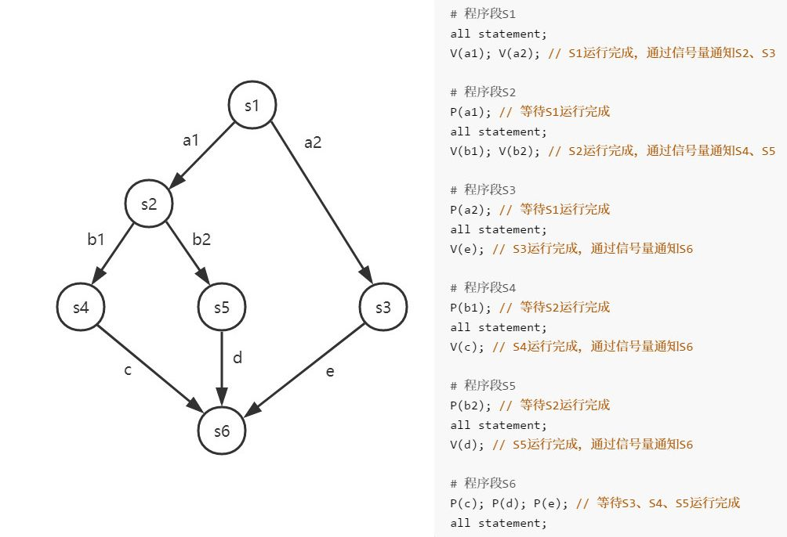
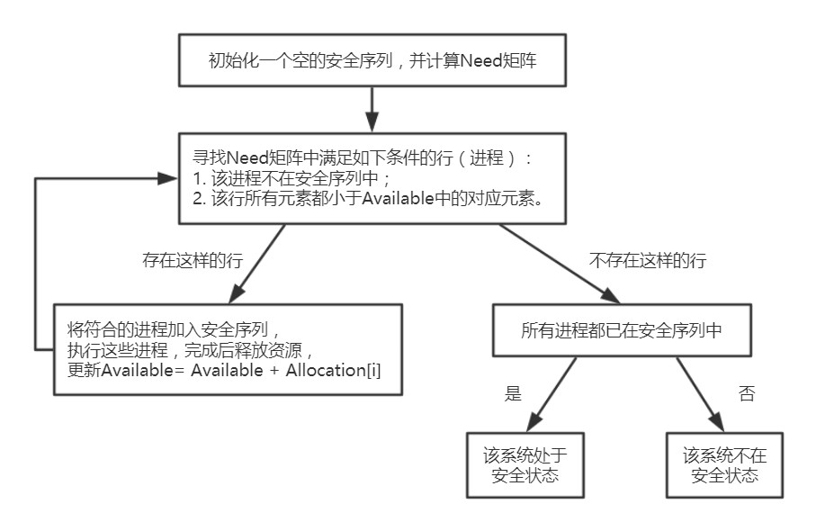

## 二、进程管理

### 1. 进程

#### 进程的概念

多道程序系统中，为使多个程序并发运行时不失封闭性，引入了进程的概念。进程是进程实体的运行过程，是**系统进行资源分配和调度的独立单位**。

系统为描述进程的基本情况和运行状态，控制和管理进程，设置了一个专门的数据结构：进程控制块PCB。创建进程实际是创建PCB，撤销进程实际是撤销PCB，PCB是进程存在的唯一标志。由程序段、数据段和PCB三部分构成进程映像（进程实体），进程映像是静态的，进程是动态的。

#### 进程的特征

-   动态性：进程是程序的一次执行，具有一定的生命周期。动态性是进程最基本的特征。
-   并发性：引入进程的目的就是为了使程序之间并发执行，以提高资源利用率。
-   独立性：进程是一个能独立运行、独立获得资源和独立接受调度的基本单位。
-   异步性：进程具有执行的间断性。
-   结构性：进程实体由程序段、数据段和PCB三部分组成。

#### 进程的状态与转换

-   运行状态：进程在处理机上运行。在单处理机环境下，每一时刻最多只有一个进程处于运行状态。
-   就绪状态：进程已获得处理机之外的一切资源，处于准备运行的状态，一旦得到处理机即可运行。
-   阻塞状态：又称等待状态，进程在等待某资源可用或等待输入输出完成，而暂停运行。
-   创建状态：进程正在被创建。首先申请一个空白的PCB，并向PCB写入一些控制和管理信息；然后系统为该进程分配运行时所需的资源；最后该进程转入就绪状态。
-   结束状态：系统首先置该进程为结束状态，然后再进行资源释放和回收等工作。

进程状态之间的一些转换如下：

-   就绪状态$\rightarrow$运行状态：就绪状态的进程获得处理机资源，进入运行。
-   运行状态$\rightarrow$阻塞状态：进程以系统调用的形式请求操作系统提高服务，如I/O操作，这是一个主动的行为。
-   运行状态$\rightarrow$就绪状态：运行中的进程在时间片用完之后，让出处理机，转为就绪状态。
-   阻塞状态$\rightarrow$就绪状态：阻塞状态下的进程获得了处理机外的资源，转为就绪状态。这是一个被动的行为，需要其它进程协助完成。

只有就绪状态才能转为运行状态。

#### 进程控制

进程的控制使用原语实现。

##### 进程创建

操作系统创建一个新进程（创建原语）的过程如下：

1.  为新进程分配一个唯一的标识号，并申请一个空白的PCB。PCB的数量有限，若PCB申请失败，则进程创建失败。
2.  为新进程的程序、数据以及用户栈分配必要的内存。如果资源不足，则等待。
3.  初始化PCB，包括标志信息、处理机状态信息、处理机控制信息、进程优先级。
4.  将新进程插入就绪队列，等待被调度。

允许父进程创建子进程，子进程继承父进程所拥有的资源。当子进程被撤销时，将这些资源归还父进程；当父进程被撤销时，子进程一并被撤销。

##### 进程终止

进程终止分为正常结束和异常结束。撤销原语的执行过程如下：

1.  根据被终止的进程的标识符，从其PCB中读取该进程的状态。
2.  若该进程仍处于运行状态，立即终止其执行，将处理机资源分配给其它进程。
3.  若该进程有子进程，将终止所有的子进程。
4.  将该进程所拥有的全部资源，归还父进程或操作系统。
5.  将PCB从队列中删除。

##### 进程的阻塞与唤醒

正在执行的进程，在等待某些数据到达或等待某些操作完成而无事可做时，由系统执行阻塞原语，进程会自发地使自己的状态变为阻塞状态。阻塞原语的执行过程：

1.  找到要被阻塞的进程的标识号对应的PCB。
2.  若该进程处于运行状态，则保护现场，将其转为阻塞状态，停止运行。
3.  将该PCB插入到相应事件的等待队列中去。

唤醒原语的执行过程：

1.  在该事件的等待队列中找到相应进程的PCB。
2.  将其从等待队列中移出，转为就绪状态。
3.  将该PCB插入到就绪队列，等待被调度执行。

##### 进程的切换

进程切换是指处理机从一个进程的运行转到另一个进程的运行。过程如下：

1.  保存处理机上下文，包括程序计数器和其它寄存器。
2.  更新PCB信息。
3.  把进程的PCB移入相应的队列。
4.  选择另一个进程执行，并更新其PCB。
5.  更新内存管理的数据结构。
6.  恢复处理机上下文。

注意：调度是指决定资源分配给哪个进程的行为，是一种决策行为；切换是指实际分配的行为，是执行行为。

#### 进程的组成

##### PCB

PCB常驻内存，包括以下内容：

1.  进程描述信息：进程标识符PID和用户标识符UID，UID决定该进程所归属的用户。
2.  进程控制和管理信息：进程当前状态、进程优先级、代码运行入口地址等。
3.  资源分配清单：用于说明有关内存地址空间的状况，打开文件的列表和I/O设备信息。
4.  处理机相关信息：处理机中各寄存器的值。

为了方便进程的调度和管理，各进程的PCB需要用适当的方法组织起来，常用的组织方式有：链接方式、所以方式。

-   链接方式将同一状态的PCB链接成一个队列，不同的状态对应不同的队列，阻塞队列根据阻塞原因的不同排成多个阻塞队列。
-   索引方式将同一状态的PCB组织在一个索引表中，不同的状态对应不同的索引表。

#### 进程的通信

-   低级通信方式：PV操作；
-   高级通信方式：共享存储、消息传递、管道通信。

##### 共享存储

通信的进程之间有一块可直接访问的共享空间，使用同步互斥工具，对共享空间进行控制，达到通信的目的。共享空间必须通过特殊的系统调用实现，分为基于数据结构的共享（低级）、基于存储区的共享（高级）。

##### 消息传递

进程间的数据传递以格式化的消息为单位，通过系统提高的发送消息和接收消息两个原语进行数据交换。分为直接通信方式和间接通信方式。

##### 管道通信

管道是指用于连接一个读进程和一个写进程以实现它们之间通信的一个共享文件，又名pipe文件。管道机制必须提供三个方面的协调能力：互斥、同步、确定双方的存在。管道是一个固定大小的缓冲区，采用版双工通信。管道中的数据一旦被读取，就被抛弃，释放空间以便写入更多数据；当读进程比写进程工作的快时，管道变空，随后的读取调用将默认地被阻塞。

### 2. 线程

#### 线程的概念

为了更好地使多道程序并发执行，提高系统资源的利用率，而引入了线程。

线程可以理解为轻量级进程，由线程ID、线程控制块、程序计数器、寄存器集合和堆栈组成，每个线程的线程ID都是唯一的。

线程是进程的一个实体，一个进程可以创建多个线程，一个线程也可以创建另一个线程。线程自身不拥有系统资源，同一个进程的多个线程共享该进程所拥有的全部系统资源。

-   引入线程之后，进程只作为除CPU以外的系统资源的分配单位，即**进程是拥有资源的基本单位**；线程则作为处理机的分配单位，即**线程是独立调度的基本单位，**也是程序执行的最小单元。
-   由于线程自己不不拥有系统资源，创建和撤销线程不需要系统为之分配或回收资源，只需要少量的系统开销用于创建线程控制块。
-   由于归属于同一进程的多个线程之间共享该进程的存储，因此线程之间的通信与同步非常容易实现，线程间可以直接读写进程数据段（如全局变量）来实现通信。


-   线程之间的切换只需要保存少量的寄存器，开销很小。同一进程内的线程切换不会引起进程的切换，不同进程内的线程切换，必定会引起进程切换。

#### 线程的实现方式

线程的实现可分为两类：用户级线程、内核级线程。

-   在用户级线程中，管理线程的所有工作都由应用程序来完成，内核意识不到线程的存在。
-   在内核级线程中，管理线程的所有工作都由内核完成，应用程序只有一个到内核级线程的编程接口。内核为进程及其内部的线程维护上下文信息，以及调度线程。

在一些系统中，会使用组合方式的多线程实现。线程创建、调度和同步都在应用程序中进行，一个应用程序的多个用户线程被映射到一些内核级线程上。

-   多对一模型：将多个用户级线程映射到一个内核级线程。
-   一对一模型：将一个用户级线程映射到一个内核级线程。
-   多对多模型：将n个用户级线程映射到一个内核级线程。

### 3. 处理器调度

处理机调度就是对处理机进行分配，就是从就绪队列中，按照一定的算法选择一个进程并将处理机分配给它运行。

一个作业从提交开始直到结束，往往要经历以下三级调度：

-   作业调度：又称高级调度。为处于外存的一个作业分配系统资源、建立相应的进程，使其获得竞争处理机的权利。作业调度就是内存与辅存之间的调度，频率很低。多道批处理系统中大多配有作业调度。
-   内存调度：又称中级调度。使暂时不能运行的进程，调至外存等待，此时的进程状态处于挂起状态。挂起状态的进程等到运行条件满足，由中级调度将其重新调入内存，转为就绪状态。
-   进程调度：又称低级调度。按照某种方法和策略，从就绪队列中选取一个进程，将处理机分配给它。进程调度是最基本的，不可或缺，进程调度的频率最高。

#### 调度的时机

现代操作系统中，不能进行进程调度和切换的情况有以下几种：

-   在处理中断的过程中。
-   进程在操作系统内核程序临界区。临界区指访问临界资源的代码，临界资源一次指允许一个进程访问。
-   其它需要完全屏蔽中断的原子操作过程中，如加锁、解锁、中断现场保护和恢复等。

在上述过程中发生了引起调度的条件时，并不能马上进行调度和切换，应置系统的请求调度标志，上述过程结束后才进行相应的调度与切换。

应该进行进程调度与切换的情况有：

-   当发生引起调度条件，且当前进程无法继续运行下去。
-   当中断或自陷处理结束后。

#### 进程调度的方式

-   非剥夺调度方式：正在运行的进程因某个事件而进入阻塞状态时，处理机分配给其它进程。非剥夺调度方式下，一旦处理机分配给一个进程，该进程就会保持处理机直到终止或转为其它状态。
-   剥夺调度方式：当一个进程正在执行时，若有某个更重要或紧迫的进程需要处理机，则立即暂停正在执行的进程，将处理机分配给这个更为重要或紧迫的进程。剥夺必须按照一定的原则，主要有：优先权、短进程优先、时间片原则。

#### 调度的基本准则

-   提高CPU利用率：应尽可能使CPU处于忙的状态。
-   提高系统的吞吐量：系统吞吐量是指单位时间内CPU完成作业的数量。短进程优先可以提高系统的吞吐量。
-   降低周转时间、等待时间、响应时间：
    -   周转时间=作业完成时间-作业提交时间；带权周转时间指作业周转时间与作业实际运行时间的比值。
    -   平均带权周转时间=（作业1的带权周转时间+……+作业n的带权周转时间）/ n。
    -   等待时间指进程处于等待处理机的时间之和。衡量一个调度算法的优劣，往往只需考虑等待时间。
    -   响应时间指才用户提交请求到系统首次产生响应所用的时间。

#### 典型的调度算法

##### 先来先服务FCFS调度算法

FCFS调度算法属于非剥夺调度算法。从后备队列中选择最先进入队列的作业/进程进行处理。

FCFS调度算法简单，但效率低。对长作业有利，对短作业不利。

##### 短作业优先SJF调度算法

SJF调度算法属于非剥夺调度算法，从后备队列中选择最短作业/短进程进行优先处理。

SJF调度算法的平均等待时间、平均周转时间最少，但对长作业不利（导致长作业长期不被调用，饥饿现象）、未考虑作业的紧迫度。作业时间的长短由用户提供的估计执行时间而定，而用户会故意缩短自己估计的作业时间，因此此算法实际并不一定能做到短作业优先调度。

##### 优先级调度算法

优先级调度算法从后备队列中选择优先级最高的作业/进程进行处理。按照新的最高优先级的进程是否能够正在执行的进程，可分为非剥夺式优先级调度算法、剥夺式优先级调度算法；按照进程的优先级是否能够改变，可分为静态优先级、动态优先级。

##### 高响应比优先级调度算法

响应比=（等待时间+要求服务时间）/ 要求服务时间

高响应比优先级调度算法主要用于作业调度，每次进行进行作业调度时，先计算后备作业队列中的每个作业的响应比，选择响应比最高的作业投入运行。

根据响应比公式可知，等待时间越长，要求服务时间越短，其响应比越高。这样一方面利于短作业优先执行，另一方面避免了长作业的饥饿现象。

##### 时间片轮转调度算法

时间片轮转调度算法是一种剥夺调度算法，主要用于分时系统，进程调度按照先来先服务的原则，将处理机分配给最先进入就绪队列的进程，但其仅能运行一个时间片。若其在使用完该时间片后未完成运行，它必须释放处理机给其它进程（被剥夺），被剥夺的进程返回就绪队列的尾端重新排队。

##### 多级反馈队列调度算法

多级反馈队列调度算法是前几种算法的结合，其实现思想是：

-   设置多个就绪队列，按照1~n的顺序队列的优先级降低。
-   时间片大小不同，优先级越高的队列中的进程，将获得越小的时间片。
-   当一个新进程进入就绪队列时，应将其放入第1级队列的末尾，按先来先服务的原则排队等待调度。当该进程执行完一个时间片后，若其仍未完成，则转入第2级队列的末尾，按先来先服务的原则排队等待调度。依次类推，直到该进程转入第n级队列，便在第n级队列中轮转。
-   只有当第1级队列为空时，才调度第2级队列中的进程运行，依次类推。每次调度都是如此。

多级反馈队列调度算法实现了新作业优先、短作业优先，长作业不会长期不被执行。

### 4. 进程同步

一次仅允许一个进程使用的资源称为临界资源。将对临界资源的访问过程分成四部分：

-   进入区：进程检查是否可以进入临界区，若可以进入，还需设置**正在访问临界区**的标志，以组织其它进程进入。
-   临界区：进程访问临界资源。访问临界资源的代码也被称为临界区。
-   退出区：清除正在访问临界区的标志。
-   剩余区：代码的其它部分。

**同步**是指多个进程为完成某一项工作，需要等待其它进程的信息或是传递给其它进程信息，而产生的工作次序上的制约关系。同步又称为直接制约关系。

**互斥**是指多个进程为竞争临界资源而产生的制约关系。互斥遵循空闲让进、忙则等待、有限等待（等待时间必须是有限时间）、让权等待（进程等待时要让出处理机）的原则。互斥又称为间接制约关系。

#### 实现临界区互斥的方法

##### 软件实现方法

0.  锁变量：用一个公用bool型变量来表示临界区是否可用，称为锁变量。锁变量会可能会导致两个进程进入临界区，当进程A检查锁变量发现临界资源可用时，下一步是将锁变量设置为临界资源不可用；但若此时正好处于时间片的末尾，进程A被调度离开处理机，进程B进入处理机，检查锁变量发现临界资源可用，进程B设置锁变量进入临界区；此时进程调度将进程B替换为进程A，进程A不会再检查锁变量，直接设置锁变量进入临界区，这样就导致了两个进程都处于临界区的错误。

1.  单标志法：用一个公用整型变量（turn）来表示谁进入了临界区。每个进程都有一个唯一的整型编号，只有当该变量与进程的编号相同时，该进程才能进入临界区。以两个互斥的进程为例，

    ```c
    # 进程0:
    while(turn != 0); // 进入区，等待自己的编号
    critical section; // 临界区
    turn = 1;  // 退出区，此时设置公用变量，使得另一进程可以访问临界区
    remainder section; // 剩余区
    # 进程1:
    while(turn != 1); // 进入区，等待自己的编号
    critical section; // 临界区
    turn = 0;  // 退出区，此时设置公用变量，使得另一进程可以访问临界区
    remainder section; // 剩余区
    ```

    从代码中可以看出，即使进程0执行完进入区就被调度出处理机，进程1也是无权访问临界资源的，达到了互斥的目的。但是若公用变量为0，而进程0不需要访问临界区，则公用变量将无法更改，需要访问临界资源的进程1也无法进入临界区。

2.  双标志法先检查：用一个bool型数组（flag[]）来表示各进程是否处于临界区。每个进程对应一个元素，当元素值为FALSE时，对应进程不在临界区；当元素值为TRUE时，对应进程处于临界区。以两个互斥的进程为例：

    ```c
    # 进程0:
    while(flag[1]); // 进入区，等待互斥进程不在临界区
    flag[0] = TRUE; // 进入区
    critical section; // 临界区
    flag[0」= FALSE;  // 退出区
    remainder section; // 剩余区
    # 进程1:
    while(flag[0]); // 进入区，等待互斥进程不在临界区
    flag[1] = TRUE; // 进入区
    critical section; // 临界区
    flag[1」= FALSE;  // 退出区
    remainder section; // 剩余区
    ```

    双标志法先检查不像单标志法那样交替使用临界区，不会出现一个进程无法进入临界区的问题。但是当按照下面的顺序调度进程时，可能会出现两个进程同时进入临界区的错误。

    ```c
    while(flag[1]); // 若此时flag[0] = FALSE, flag[1] = FALSE
    while(flag[0]);
    flag[0] = TRUE;
    flag[1] = TRUE;
    ```

3.  双标志法后检查：此算法与双标志先检查法类似，但是是先置位后检查。以两个互斥的进程为例：

    ```c
    # 进程0:
    flag[0] = TRUE; // 进入区，先置位
    while(flag[1]); // 进入区，等待互斥进程不在临界区
    critical section; // 临界区
    flag[0」= FALSE;  // 退出区
    remainder section; // 剩余区
    # 进程1:
    flag[1] = TRUE; // 进入区，先置位
    while(flag[0]); // 进入区，等待互斥进程不在临界区
    critical section; // 临界区
    flag[1」= FALSE;  // 退出区
    remainder section; // 剩余区
    ```

    后检查法虽然不会像先检查法那样会导致两个进程同时进入临界区，但是 两个进程可能会发现对方都是TRUE，而互相谦让导致饥饿现象。

4.  Peterson's算法：在双标志后置位法的基础上，增加了公用变量turn。想进入临界区的进程先设置自己的标志，再更改turn标志。以两个互斥的进程为例：

    ```c
    # 进程0:
    flag[0] = TRUE; turn = 1; // 进入区，先置位
    while(flag[1] && turn == 1); // 进入区，等待互斥进程不在临界区
    critical section; // 临界区
    flag[0」= FALSE;  // 退出区
    remainder section; // 剩余区
    # 进程1:
    flag[1] = TRUE; turn = 0; // 进入区，先置位
    while(flag[0] && turn == 0); // 进入区，等待互斥进程不在临界区
    critical section; // 临界区
    flag[1」= FALSE;  // 退出区
    remainder section; // 剩余区
    ```


    Peterson's算法利用flag解决临界资源的互斥访问，利用turn解决饥饿现象。

##### 硬件实现方法

1.  中断屏蔽方法：当一个进程正在使用处理机执行它的临界区代码时，会屏蔽所在CPU的中断（CPU只在发生中断时才引起进程切换），防止切换到其它进程。执行完临界区后在打开中断。

    这种方法限制了处理机交替执行的能力，执行效率降低。

2.  硬件指令方法：采用原子操作指令，其执行时会屏蔽内存总线的中断，防止其它进程操作内存。

    (1). TSL指令或TestAndSet指令：其功能是读取指定标志，并把它设置为真。将每个临界资源设置一个共享bool变量lock，lock为TRUE时表示该资源正在被占用，lock为FALSE时表示该资源未被占用。

    ```c
    while(TestAndSet(&lock)); 
    // lock为TRUE时，表示其它进程正在访问临界资源，会一直循环；一旦其它进程退出临界区，lock变为FALSE，不在继续循环，并置lock为TRUE
    critical section; // 临界区
    lock = FALSE; // 退出区
    remainder section; // 剩余区
    ```

    (2).XCHG指令或Swap指令：其功能是交换两个字的内容。将每个临界资源设置一个共享bool变量lock，同时每个进程设置一个局部bool变量key，用于与lock交换信息。

    ```c
    key = TRUE; // 进程想要访问临界资源时，将key置TRUE
    while(key != FALSE)  
        Swap(&lock, &key);
    // 对于上述循环，如果有其它进程访问临界区，lock值为TRUE，此时交换key与lock，其值都为TURE，会一直循环；当使用临界资源的进程进入退出区，将lock置FALSE，此时交换key与lock的值，key变为FALSE，退出循环。同时交换使得lock变为TRUE，阻止其它进程。
    critical section; // 临界区
    lock = FALSE; // 退出区
    remainder section; // 剩余区
    ```

    硬件指令方法中进程在等待临界资源时一直循环，会耗费处理机资源，不能实现让权等待。多个进程访问同一个临界资源时，可能会使某个进程因调度进处理机的时机不在其它进程的退出区，而一直无法访问临界资源，造成饥饿现象。

软件硬件两种方式中，只有Peterson's算法、TSL、XCHG是正确的。

#### 信号量与PV操作

信号量机构是一种功能较强的机制，用来解决互斥和同步问题。它只有两个标准的原语：P操作、V操作（首字母来自荷兰语）。

1.  设一个整型信号量S，P操作和V操作可描述为：

    ```c
    P(S) {
        while(S <= 0); // 当S非正时，不断循环测试
        S--;
    }
    V(S) {
        S++;
    }
    ```

    由于P操作需要不断循环测试，因此这种方式未遵循让权等待。

2.  设一个记录型信号量S，S的结构为

    ```c
    typedef struct {
        int value;
        struct process *L; // 进程链表L,记录等待临界资源的进程
    } semaphore;
    ```

    P操作和V操作可描述为：

    ```c
    P(semaphore S) {
        S.value--;
        if (S.value < 0) { // 此时临界资源是否已被分配完
            add this process to S.L; // 将该进程添加到等待队列
            block(S.L); // 阻塞等待队列中的进程
        }
    }
    V(semaphore S) {
        S.value++;
        if (S.value <= 0) { // 当该进程释放临界资源时，检测是否有等待的进程
            remove a process P from S.L; // 将进程P从等待队列中移出
            wakeup(P); // 唤醒进程P，进程P将继续执行进入临界区
        }
    }
    ```
    这种方式下可以实现让权等待。


##### 使用信号量实现同步

设分布位于进程0、进程1的两条指令x、y，y的执行需要x先执行完，x的执行与否通过一个信号量S表征。

```c
semaphore S = 0;

# 进程0
x;
V(S); // 此时指令x已经执行完，设置信号量

# 进程1
P(S); // 检测信号量，等待指令x执行完
y;
```

##### 使用信号量实现互斥

设进程0、进程1互斥访问一个临界资源，使用一个信号量S实现。S的初始值为1，即可用临界资源数量为1。

```c
semaphore S = 1;

# 进程0
P(S);
critical section; // 临界区
V(S);

# 进程1
P(S);
critical section; // 临界区
V(S);
```

只有有一个进程进入临界区，就会把S减1，S变为0，阻止其它进程进入临界区。

##### 使用信号量实现前驱关系

如下图的前驱关系，通过信号量实现。



#### 管程

管程将进程间共享的硬件资源和软件资源抽象成一个数据结构，用少量的信息描述其资源特性，而忽略资源本身的细节。管程包含该数据结构，以及用于初始化该数据结构、操作该数据结构的方法。

上述的数据结构局部于管程，对其访问只能通过调用管程提供的方法。并且管程限制每次只允许一个进程进入管程。

#### 经典同步问题

##### 生产者-消费者问题

问题描述：一组生产者和一组消费者共享一个初始为空、大小为n的仓库，每次只允许一个人操作仓库，

-   只有仓库没满，生产者才能放入产品，否则等待；
-   只有仓库不空，消费者才能取出产品，否则等待。

```c
semaphore mutex = 1; // 临界区（仓库）互斥信号
semaphore empty = n; // 空余位置数量
semaphore full = 0; // 存入商品数量

# 生产者
while(1) {
    produce an item;
    P(empty); // 检查是否有空余位置，若没有就等待
    P(mutex);
    add this item to buffer; // 临界区
    V(mutex);
    V(full);
}

# 消费者
while(1) {
    P(full); // 是否有存下的商品可用，若没有就等待
    P(mutex);
    remove an item from buffer; // 临界区
    V(mutex);
    V(empty);
    consume this item;
}
```

问题描述：桌上有一个盘子，只能存放一个水果。爸爸只向盘子里放苹果，妈妈只向盘子里放橘子，儿子只等着吃盘子里的苹果，女儿只等着吃盘子里的橘子。

这个问题中爸爸和妈妈构成互斥关系，爸爸和儿子、妈妈和女儿构成分布构成同步关系。

```c
semaphore plate = 1; // 使用盘子的互斥信号
semaphore apple = 0, orange = 0; // 同步信号

# 爸爸
while(1) {
    P(plate); // 互斥地使用盘子
    put an apple on the plate;
    V(apple);
}

# 妈妈
while(1) {
    P(plate); // 互斥地使用盘子
    put an orange on the plate;
    V(orange);
}

# 儿子
while(1) {
    P(apple); // 等待盘子中有苹果
    take an apple from the plate;
    V(plate); // 爸爸-儿子这一同步进程完成，释放盘子的使用权
}

# 女儿
while(1) {
    P(orange); // 等待盘子中有橘子
    take an orange from the plate;
    V(plate); // 妈妈-女儿这一同步进程完成，释放盘子的使用权
}
```

##### 读者-写者问题

问题描述：有读者、写者两种多个进程，共享一个文件。要求：

-   同时允许多个读者进程对该文件操作；
-   每次只允许一个写者进程对该文件操作；
-   写者进程对文件操作前，必须保证其它任何读写进程都已退出对该文件的操作；
-   写者进程在完成文件操作前，不允许其它任何读写进程对文件操作。

```c
int count = 0; // 记录读者进程的数量
semaphore mutex = 1; // 保护更新count变量时互斥
semaphore rw = 1; // 保证读写互斥地访问文件

# 写者进程
while(1) {
    P(rw);
    writing; // 因为写者进程与其它任何进程都互斥
    V(rw);
}

# 读者进程
while(1) {
    P(mutex);
    if (count == 0) 
        P(rw); // 阻塞写者进程
    // 若count不为0，说明已有读者进程在操作共享文件，已经阻塞了写者进程
    count++;
    V(mutex);
    reading;
    P(mutex);
    count--;
    if (count == 0)
        V(rw); // 如果没有读者进程，则释放共享文件的使用权
    V(mutex);
}
```

上述算法读者进程有更高的优先级，若有实现读写进程有相同的优先级，可增加一个信号量。

```c
int count = 0; // 记录读者进程的数量
semaphore mutex = 1; // 保护更新count变量时互斥
semaphore rw = 1; // 保证读写互斥地访问文件
semaphore w = 1; // 用于实现优先级

# 写者进程
while(1) {
    P(w); // 在无写者进程时，要求对共享文件操作
    P(rw);
    writing; // 因为写者进程与其它任何进程都互斥
    V(rw);
    V(w);
}

# 读者进程
while(1) {
    P(w); // 如果此时有写者进程请求，便阻塞了新的读者进程进入
    P(mutex);
    if (count == 0) 
        P(rw); // 阻塞写者进程
    // 若count不为0，说明已有读者进程在操作共享文件，已经阻塞了写者进程
    count++;
    V(mutex);
    V(w);
    reading;
    P(mutex);
    count--;
    if (count == 0)
        V(rw); // 如果没有读进程，则释放共享文件的使用权
    V(mutex);
}
```

##### 哲学家进餐问题

问题描述：如下图，五位哲学家饥饿时，会依次拿起左右两把叉子进食，进食完会将叉子放回原处。如果哲学家无法获得两个叉子，则等待。

五位哲学家之间是互斥关系，可能会造成每位哲学家左手都有叉子，但是无法获得右手的叉子的死锁。


设哲学家的编号为0~4，编号i的哲学家的左手边的叉子编号为i，右手边的叉子的编号为[(i+1) % 5]。

```c
semaphore chopstick[5] = {1, 1, 1, 1, 1};
semaphore mutex = 1;

# 每位哲学家
while(1) {
    P(mutex);
    P(chopstick[i]);
    P(chopstick[(i+1)%5]);
    V(mutex);
    // 将拿两个叉子放在一起，避免了拿起一个叉子就被调度，而导致的死锁
    eat；
    V(chopstick[i]);
    V(chopstick[(i+1)%5]);
}
```

##### 吸烟者问题

问题描述：有三个吸烟者和一个供应者，有三种材料：烟草、纸、胶水。三个吸烟者每人分别有三个材料中的一种；供应者有三种材料，但是他每次只会将其中的两种放到桌子上。此时拥有最后一种材料的吸烟者会将三种材料制作称烟并抽掉，并告诉供应者已完成。供应者继续将材料放到桌上，一直重复。

```c
int random; // 随机数，产生供应者的行为
semaphore offer1 = 0; // 定义信号量，对应烟草和纸的组合
semaphore offer2 = 0; // 定义信号量，对应烟草和胶水的组合
semaphore offer3 = 0; // 定义信号量，对应纸和胶水的组合
semaphore finish = 0; // 定义信号量，抽烟是否完成

# 供应者进程
while(1) {
    random = (0,1,2)中随机一个;
    if (random == 0) V(offer1);
    else if (random == 1) V(offer2);
    else V(offer3);
    P(finish);
}

# 拥有烟草的吸烟者
while(1) {
    P(offer3);
    make a cigarette and smoke it;
    V(finish)；
}

# 拥有纸的吸烟者
while(1) {
    P(offer2);
    make a cigarette and smoke it;
    V(finish)；
}

# 拥有胶水的吸烟者
while(1) {
    P(offer1);
    make a cigarette and smoke it;
    V(finish)；
}
```

### 5. 死锁

死锁产生的原因：

-   对少量不可剥夺的系统资源竞争；
-   进程推进顺序非法。

死锁产生的必要条件。以下四个条件必须同时满足才会造成死锁，

-   互斥条件：某种系统资源每次只允许一个进程占用。
-   不剥夺条件：进程未使用完该资源，不能被其它进程强行夺走，只能在使用完之后主动释放。
-   请求和保持条件：进程需要两项资源，并且已经获得了其中一项，而另一项正在被其它进程使用。此时该进程因请求另一项资源而被阻塞，但是不会释放已获得的资源。
-   循环等待条件：存在循环等待链。该链中每个进程已获得的资源同时被链中下一个进程所请求，此时若链中每个进程的保持自己已有的资源，则每个进程都无法获得请求的另一个资源而无限等待。

循环等待不等同于死锁，在循环等待中如果链上某个进程所请求的资源被链外的一个进程释放提供，循环等待就被解除了。

#### 死锁的处理

##### 死锁预防

死锁预防只需破坏四个必要条件中的一个即可。

-   破坏互斥条件：对应临界资源不可行。
-   破坏不剥夺条件：保持有不剥夺资源的进程在等待时，必须释放保持的资源。这种方法下进程会反复申请资源增加系统开销，常用于状态易于保存和恢复的资源，如CPU寄存器、内存。
-   破坏请求和保持条件：采用预先静态分配方法，即进程运行前一次申请完它需要的所有资源，否则不投入运行。由于个别资源可能仅在进程某个时间点使用一次，其它时间空闲，这种方法会造成资源的浪费。
-   破坏循环等待条件：采用顺序资源分配法。首先系统给所有的资源编号，并规定进程在申请资源时必须按编号递增的顺序申请，同类资源一次申请完，这样就无法形成循环。这种方法限制了新设备的加入，造成资源的浪费，同时增加了编程的难度。

##### 死锁避免

系统安全状态：系统能够按某种顺序，为每个进程分配其所需的资源，满足其对资源的最大需求，使得每个进程都能顺序地完成的状态。此时的进程执行顺序称为安全序列。如果系统无法找到一个**安全序列**，则系统处于不安全状态。

例子：设系统有3个进程P1、P2、P3，分别需要10台、4台、9台磁带机。系统一共有12台磁带机，其中P1保持有5台，P2保持有2台，P3保持有2台，剩余3台未分配。此时3台磁带机无法满足P1、P3的需求，满足P2的需要。可以按照如下顺序执行：

-   分配2台磁带机给P2，P2运行完成后释放所有的磁带机，空闲的磁带机变为5台；
-   分配5台磁带机给P1，P1运行完成后释放所有的磁带机，空闲的磁带机变为10台；
-   分配7台磁带机给P3，P3运行完成。

此时的安全序列为P2$\rightarrow$P1$\rightarrow$P3，系统处于安全状态。

**银行家算法：**

-   当进程首次申请资源时，要测试该进程对资源的最大需求量。如果系统现存的空闲资源能够满足，则按当前的申请量进行分配，否则推迟分配。
-   当进程执行中继续申请资源时，要先测试该进程已占用的资源数+本次想申请的资源数是否超过了该进程对资源的最大需求量。t
    -   若超过则拒绝分配；
    -   若没有超过则测试系统现存的空闲资源能否满足该进程尚需的最大资源量，能满足则分配，否则推迟分配。

**银行家算法的过程：**

-   可利用资源矢量$Available$：含有$m$个元素的数组，每个元素代表一个资源的可用数目。
-   最大需求矩阵$Max$：为$n \times m$的矩阵，对应$n$个进程$m$种资源。$Max[i, j] = K$表示进程$i$对资源$j$的最大需求为$K$。
-   分配矩阵$Allocation$：为$n \times m$的矩阵，$Allocation[i, j] = K$表示进程$i$已经分配得到资源$j$的数量为$K$。
-   需求矩阵$Need$：为$n \times m$的矩阵，$Need[i, j] = K$表示进程$i$需要资源$j$的数量为$K$。

上述矩阵存在关系：$Need = Max - Allocation$。

设进程$P_i$的资源请求矢量为$Request_i$，此时进程$P_i$申请$j$类资源，具体步骤如下：

1.  计算$Need$矩阵：$Need = Max - Allocation$；

2.  测试$Request_i[j] \le Need[i, j]$，不成立则拒绝资源的申请；

3.  测试$Request_i[j] \le Available[i, j]$，不成立则推迟分配；

4.  系统按照$Request_i[j]$的数量**试探分配**给$P_i$资源，并更新数据：

    $Available = Available - Request_i$

    $Allocation[i, j] = Allocation[i, j] + Request_i[j]$

    $Need[i, j] = Need[i, j] - Request_i[j]$

5.  执行系统安全算法，测试系统在此次分配后是否仍处于安全状态。若安全，则将资源分配给进程；否则，作废此次试探分配，恢复原来的资源分配状态，让进程等待。安全性算法如下：

    

##### 死锁检测和解除

系统死锁可利用资源分配图描述。如下图


圆圈表示一个进程，方框表示一类资源，方框中的小圈表示一个资源。从进程到资源的有向边为请求边，从资源到进程的有向边为分配边。上图中P1已经得到2个R1资源，请求一个R2资源；P2已经得到一个R1资源和一个R2资源，请求一个R1资源。

判断系统是否死锁转变为简化资源分配图。若资源分配图中经过简化所有的边都可以消去，则系统不会死锁。按照如下方法简化：

1.  找到可以满足其所有请求的点（进程），如P1请求一个R2资源，R2有一个空闲的资源，可以满足P1的请求。此时P1可以完成运行，消去所有和P1相关的边。
2.  由于上述进程释放了一些资源，则可以唤醒原来阻塞的进程。再次寻找可以满足其所有请求的点，消去和其相关的边。重复此步骤，直到无法继续进行。

若最后所有的边都被消去，称此资源分配图是可以完全简化的，表示系统不会死锁。否则系统会发生死锁。

**死锁定理：**系统S状态为死锁的条件是当且仅当S状态的资源分配图是不可完全简化的。

一旦检测出死锁，应采取措施解除死锁。

-   资源剥夺法：挂起某些死锁的进程，并抢占它的资源重新分配给其它死锁进程。
-   撤销进程法：强制撤销部分、甚至全部死锁进程，并剥夺这些进程的资源。撤销按照进程优先级和代价高低判断。
-   进程回退法：让一个或多个进程回退到足以回避死锁的状态，此时进程自动放弃资源。此种方法下需要系统保持进程的历史信息，设置还原点。