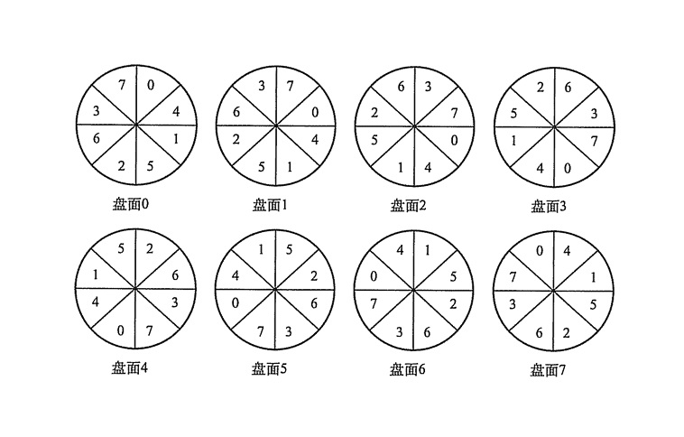

## 四、文件管理

### 1. 文件系统概念

在系统运行时，计算机以进程为基本单位；在用户进程输入、输出中，以文件为单位。

文件是指由创建者所定义的一组信息的集合。文件包含如下属性：名称、标识符（唯一标签）、类型、位置（指针）、大小、保护（访问控制信息）、日期时间和用户标识等，所有这些信息都保存在目录结构中。

文件的基本操作有：

-   创建文件：分配空间，并在目录中创建条目，记录文件名称、文件所在位置和其它一些信息。
-   写文件：系统为每个文件维护一个写指针，指明写入的位置。
-   读文件：系统为每个文件维护一个读指针，指明读取的位置。
-   删除文件：删除文件的目录项，回收文件的存储空间。
-   截断文件：保持文件的属性不变，长度变为0。
-   文件打开与关闭：文件打开时将文件属性和磁盘地址表加载到内存中；文件关闭时首先将缓冲区的内容写入文件，后释放其内存。

文件的基本类型可以分为字符型文件和二进制文件。

#### 文件逻辑结构

文件的逻辑结构是从用户观点出发看到的文件组织形式，与存储介质的特性无关。按照逻辑结构文件分为两种：

-   无结构文件：又称流式文件，以字节为单位，将数据按顺序组织成记录并保存。无结构文件对记录的访问只能通过穷举搜索的方式进行。
-   有结构文件：有结构文件按记录的组织形式可分为，
    -   顺序文件：文件中的记录一个接一个地顺序排列，每条记录可以是定长或者变长的，可以顺序存储或者以链表形式存储，访问记录时顺序搜索文件。
        -   串结构：记录按时间顺序排列。
        -   顺序结构：按找某个关键字的顺序排列。这种方式下增加和删除单个记录十分困难。
    -   索引文件：索引文件含有一张索引表，记录着每个的索引号、记录长度、指向该记录的指针。索引表本身是一个定长记录的顺序文件，通过索引可以成百上千倍地提高访问速度。
    -   索引顺序文件：将顺序文件的所有记录分成若干组，建立一个索引表记录每组中第一个记录的位置，即索引表项中包含指向每组第一个记录的指针。索引顺序文件提高了顺序文件的查找效率。
    -   直接文件或散列文件：给定记录的键值或通过Hash函数转换的键值直接决定记录的物理地址，这种文件没有顺序性。散列文件有很高的存取速度，但是回引起冲突，即不同关键字的散列函数值相同。

#### 目录结构

目录在用户所需文件名和文件之间提高一种映射，实现文件按名存取；目录提高了对文件的检索速度，提供用于控制访问文件的信息。

##### 文件控制块

操作系统为实现目录管理，引入了文件控制块FCB的数据结构。文件控制块主要包含：

-   文件基本信息：文件名、文件物理位置、文件逻辑结构、文件物理结构等。
-   存取控制信息：文件的存取权限等。
-   使用信息：文件建立的时间、修改时间等。

文件控制块的有序集合称为文件目录，创建一个新文件时，操作系统将分配一个FCB并存放在文件目录中，成为目录项。

检索目录文件时只需使用文件名即可，不需要其它文件信息，因此有的操作系统（UNIX）将文件名和其它文件描述信息分开，文件描述信息单独形成一个称为索引结点的数据结构，简称 **i 结点**。此时文件目录中的每个目录项仅包含文件名和指向 i 结点的指针。

一个FCB的大小为64字节，大小为1KB的盘块可以存放16个FCB；UNIX中一个目录项仅为16字节，一个盘块中可以存放64个目录项。这样查找文件的时间可以减少到原来的1/4，大大节省了系统开销。

UNIX系统的**索引结点包含**：

-   文件主标识符：拥有该文件的个人或小组的标识符。
-   文件类型：普通文件、目录文件、特别文件。
-   文件存取权限：各类用户对该文件的存取权限。
-   文件物理地址：数据文件所在盘块的编号。
-   文件长度
-   文件存取时间：本文件最近被进程存取的时间、最近被修改的时间、索引结点最近被修改的时间。
-   文件被打开：磁盘索引结点复制到内存中以便于使用。

内存索引结点又增加了以下内容：

-   索引结点编号
-   状态：是否上锁或被修改。
-   访问计数
-   逻辑设备号
-   链接指针：设置分别指向空闲链表和散列队列的指针。

##### 目录结构

目录的操作：搜索、创建文件、删除文件、显示目录、修改目录。

以下几种目录结构：

-   单级目录结构

    整个文件系统中只建立一张目录表，每个文件占用一个目录项。

    访问一个文件时，先按文件名在目录表中找到相应的FCB，经合法性检查后执行相应的操作。创建一个文件时，先检索所有目录项，确保没有重名，然后在该目录表中增设一项，把FCB的全部信息存入该项。删除一个文件时，先从目录表中找到该文件的目录项，回收该文件所占的存储空间，然后清除该目录项。

-   两级目录结构

    将文件目录分为主文件目录MFD和用户文件目录UFD，主文件目录项记录用户名和相应用户文件目录所在的存储位置；用户文件目录项记录用户文件的FCB信息。这种结构解决了不同用户的同名文件的重名问题，在目录上实现了不同用户的访问限制，提高了文件的安全性。

-   多级目录结构

    将两级目录结构的层次关系加以推广，形成多级目录结构，即树形目录结构。由“/”分隔符连接的绝对路径或相对路径标识文件。

    树形目录结构可以很方便地对文件进行分类，更有效地进行文件的管理和保护。但是查找文件需要逐级访问中级结点，增加了磁盘开销。

-   无环图目录结构

    树形目录结构不适合实现文件共享，在目录基础上增加一些指向同一结点的有向边，此时此目录结构形成一个有向无环图。

    无环图目录结构方便实现文件的共享，但使得系统的管理变得更加复杂。

#### 文件共享

以下的硬链接和软链接都属于静态链接。两个进程同时对一个文件进行操作，这样的共享称为动态链接。

##### 基于索引结点的共享方式（硬链接）

将文件的物理地址及其它文件属性等信息放入索引结点中，在目录项中只设置文件名和指向该文件索引结点的指针，只要将该目录项放入不同用户的目录即可实现共享。同时在索引结点中设置一个链接计数count，用于统计链接到本索引结点上的用户目录项的数目。每当一个用户删除该文件时，count减1，只有count减至0时，系统才完全删除该文件。

##### 利用符号链实现文件共享（软链接）

为实现某个文件的共享，由系统创建一个LINK类型的新文件，与需要共享文件的文件名相同。新文件被链接到其它共享用户的目录中，其内容只有共享文件的路径名。这样的链接称为符号链接，新文件中的路径名称为符号链。

当文件拥有这删除文件后，其它用户使用符号链接访问该文件会发生错误，因为只有文件拥有者才有指向文件的指针，其它用户只拥有路径名。但是如果其它用户在此目录上创建了同名文件，符号链接又能够使用了，只不过文件已不是原来那个文件，也可能引发错误。

使用符号链实现文件共享，操作系统需要先读取LINK文件，才能对共享文件操作，增加了磁盘的开销。

硬链接的查找速度比软链接快。

#### 文件保护

文件保护通过口令保护、加密保护、访问控制等方式实现。

现代操作系统将访问控制列表与用户、组和其它成员访问控制方案一起使用。多级目录结构需要保护子目录，这与文件保护的机制时不同的。

##### 访问控制

访问类型：读、写、执行、添加（在文件结尾添加新内容）、删除、列表清单（列出文件名和属性）、重命名、复制、编辑等。

访问控制最常用的方法是根据用户身份进行控制，而实现基于身份访问的最普通的方法是为每个文件和目录增加一个访问控制列表ACL，以规定每个用户及其所允许的访问类型。

精简的访问列表采用拥有者、组、其它用户三种用户类型，只需要用三个域来列出这三种用户的访问权限即可。UNIX系统采用此方法。

##### 口令

口令指用户建立一个文件时提供的一个口令，系统为其建立FCB时附上相应口令，同时告诉允许共享该文件的其它用户。用户请求访问时必须提供相应口令。缺点是口令之间存储在系统内部不过安全。

##### 密码

密码指用户对文件进行加密，访问文件时需要使用密钥。这种方法保密性强，但是需要花费解密和加密的时间。

### 2. 文件系统实现

现代操作系统的文件系统类型：FAT32、NTFS、ext2、ext3、ext4等。

#### 文件系统的层次结构

1.  用户调用接口：文件系统为用户提供的与文件和目录有关的调用。
2.  文件目录系统：管理文件目录，主要功能有管理活跃文件目录表、管理读写状态信息表、管理用户进程的打开文件表、管理和组织在存储设备上的文件目录结构、调用下一级存取控制模块。
3.  存取控制验证：将用户的访问要求与FCB中的访问控制权限进行比较，以确认访问的合法性。
4.  逻辑文件系统与文件信息缓冲区：将用户读写的逻辑记录转换成文件逻辑结构内的相应块号。
5.  物理文件系统：将上述相应块号转换成实际的物理地址，即逻辑地址转换为物理地址。
6.  分配模块：分配和回收辅存空间。
7.  设备管理程序模块：分配设备、分配设备读写缓冲区、磁盘调度、启动设备、处理设备中断、释放设备读写缓冲区、释放设备等。

#### 目录实现

目录实现的基本方法有线性列表和哈希表两种，线性列表实现对应线性查找，哈希表实现对应散列查找。

目录查询需要大量的I/O操作，因此操作系统将当前使用的文件目录复制到内存，以后使用该文件目录只要在内存中操作，降低了磁盘的操作次数，提供了系统速度。

##### 线性列表

使用存储文件名和数据块指针的线性表实现。创建新文件时必须搜索目录确认没有同名文件，然后在目录表后增加一个目录项。删除文件时根据给定的文件名搜索目录表，释放分配给该文件的存储空间，可以将目录项标记为不再使用，或者将它移动到空闲目录项表上。

线性列表的优点是实现简单，但是使用较为费时。

##### 哈希表

根据文件名获得一个值，并返回一个指向线性列表中元素的指针。这种方法的优点是查找迅速，插入和删除也比较简单，但是需要一些预备措施来避免冲突。

#### 文件实现

##### 文件分配方式（对非空闲空间的管理）

文件分配方式常用的有三种：连续分配、链接分配、索引分配。

1.  连续分配：每个文件在磁盘上占用一组连续的块，支持顺序访问和直接访问。

    连续分配实现简单，存取速度快。缺点是文件长度很难动态增加，一旦增加就需要大量移动盘块；且反复增删文件会产生外部碎片。因此连续分配方式适合固定长度的文件。

2.  链接分配：分为隐式链接和显示链接两种。

    -   隐式链接：每个文件对应的都是一个磁盘块组成的链表，具体为每个磁盘块都有一个指向下一个磁盘块的指针，这些指针对用户透明。目录项包含文件第一块的指针和最后一块的指针。

        隐式链接的缺点是无法直接访问磁盘块，必须通过指针顺序访问，速度慢；每个盘块的指针占用了存储空间；一旦其中的一个指针丢失，则整个文件丢失。

    -   显示链接：为整个磁盘建立一张显示的链接表，称为文件分配表，保存了磁盘上每一个文件的所有链接指针，文件目录项中有指向该文件物理块指针链的头指针。

3.  索引分配：系统将文件的所有盘块的盘块号集中放在一起组成一张**索引块**，每个文件都有索引块，是一个磁盘块地址的数组，一般为一物理块大小。创建文件时，文件索引块的所有指针都为空，当写入某物理块时，将其地址写入索引块的对应条目。索引分配支持直接访问，且没有外部碎片。其缺点是索引块的分配增加了系统开销。

    由于每个文件必须有一个索引块，索引块的大小应尽可能小，以减少存储空间占用，但是索引块太小就无法支持大文件。可以用以下机制解决：

    -   链接方案：通过物理块指针将多个索引块链接起来，使一个文件支持更多的索引条目。
    -   多层索引：即建立指向索引块的索引块，为支持更大的文件可以建立多层索引。
    -   混合索引：将多种索引方式相集合的分配方式。

##### 文件存储空间管理（对空闲空间的管理）

文件存储空间的划分和初始化：一般来说一个文件存储在一个文件卷中，文件卷分为目录区和文件区，目录区存放文件控制信息FCB，文件区存放文件数据信息。现代操作系统存在很多不同的文件管理模块，以应对不同的文件格式的逻辑卷。文件卷在提供文件服务前，必须由对应的文件程序进行初始化，划分好目录区和文件区，建立空闲空间管理表格及存放逻辑卷信息的超级块。

文件存储管器的空间管理实质上是对空闲块的组织和管理，包括空闲块的组织、分配与回收等问题。

1.  空闲表法

    空闲表法属于连续分配方式，为每个文件分配一块连续的存储空间。系统为外存上的所有空闲区建立一张空闲盘块表，每个空闲区对应一个空闲表项，其中包括表项序号、该空闲区第一个盘块号、该空闲区的盘块数量等信息；空闲表项按照其起始盘块号递增的顺序排列。

    空闲盘区的分配和内存的动态分配类似，同样采用首次适应算法、循环首次适应算法等。系统回收用户所释放的存储空间，也采用类似内存回收的方法。

2.  空闲链表法

    将所有空闲盘区形成一条空闲链表，可分为空闲盘块链和空闲盘区链。空闲盘块链以空闲盘块为单位，用户创建文件请求分配存储空间时，系统从链首开始，一次摘下适当数目的盘块分配给用户；删除文件时，系统回收存储空间插入链尾。空闲盘区链以空闲盘区为单位，每个空闲盘区包含一个指向下一个空闲盘区的指针和本盘区的大小，分配盘区的方法和动态分区分配类似，通常采用首次适应算法；回收盘区时，将回收区与相邻的空闲盘区合并。

3.  位示图法

    位示图（二维表）利用二进制位来表示磁盘中一个盘块的使用情况，磁盘上所有的盘块都有一个二进制位与之对应。

    盘块的分配：顺序扫描位示图，从中找出一个或一组其值为0的二进制位；将所找到的二进制位转换成相应的盘号。修改位示图中分配盘区的对应二进制位为1。

    计算盘块号的方法：位示图中的行号为$i$（0\~n），列号为$j$（0\~n），盘块号为$b = n(i-1) + j$。

    盘块的回收：将回收盘块号转换为位示图中的行号和列号；修改位示图。

    计算位示图行列号的方法：$i = (b-1) \ \mathrm{div} \ (n+1), j = (b-1) \ \mathrm{mod} \ (n+1)$。

4.  成组链接法

    空闲表法和空闲链表法都不适用于大型文件系统，在UNIX系统中采用成组链接法，这种方法结合了空闲表法和空闲链接法，其大致思想是：将顺序的n个空闲扇区（1\~n）地址保存在第0个空闲扇区内，其后第n个空闲扇区内则保存另一组顺序空闲扇区（n+1\~2n）的地址，如此类推，直至所有空闲扇区均予以链接。系统只需要保存一个指向第0个空闲扇区的指针即可，这种方式可以迅速找到大批空闲块地址。

    表示文件存储器空闲空间的位向量表或第一个成组链块以及卷中的目录区、文件区划分信息都需要存放在辅存储器中，一般放在卷头位置，在UNIX系统中称为超级块。在对卷中文件操作前，需要预先将超级块读入系统空闲的主存，并且经常保持主存中超级块与辅存卷中的超级块的一致性。

### 3. 磁盘组织与管理

#### 磁盘的结构

磁道、柱面、扇区（盘块）。磁盘的地址用“柱面号-盘面号-扇区号”表示。

#### 磁盘调度算法

##### 读写时间

-   寻找时间/寻道时间$T_s$：磁头移动到指定磁道所需时间，包含跨越$n$条磁道的时间和磁臂启动时间$s$，即$T_s = m \times n + s$。其中$m$与磁盘驱动器速度有关，约为0.2ms；磁臂启动时间约为2ms。
-   延迟时间$T_r$：磁头找到磁道后定位到指定扇区的时间，与磁盘的转速$r$有关，平均为$T_r = \cfrac 1{2r}$。
-   传输时间$T_t$：从磁盘读出或向磁盘写入数据所经历的时间，取决于每次所读写的字节数$b$和磁盘的转速，设每个磁道上的字节数为$N$，则$T_t = \cfrac b {rN}$。
-   总平均存取时间$T_a$为：$T_a = T_s + \cfrac 1{2r} + \cfrac b{rN}$。

##### 调度算法

-   先来先服务FCFS算法：FCFS算法根据进程访问磁盘的先后顺序进程调度。该算法是一种最简单的调度算法，具有公平性；但大量进程竞争使用磁盘时，这种算法性能上接近于随机调度。
-   最短寻找时间优先（SSTF）算法：SSTF算法优先处理磁道与当前磁头所在磁道最近的访问请求，使访问时间最小。但是这并不难保证平均寻找时间最小，且当某磁道附件的访问请求频繁时远的磁道就长时间得不到访问，造成饥饿现象。
-   扫描（SCAN）算法：又称为电梯算法，SCAN算法优先处理当前磁头移动方向上距离最近的磁道的访问请求，实际就是在SSTF算法上增加了方向因素。SCAN算法对最近扫描过的区域不公平（再近也不回头），在访问局部性上不如FCFS和SSTF算法。
-   循环扫描（C-SCAN）算法：在SCAN算法的基础上增加了磁头单向移动的限定。磁头当移动到一端后直接快速返回起始端，实际中改进为磁头移动到最远的请求，完成该请求后立即返回起始端，而不是到磁盘端点，这种改进的算法称为LOOK算法和C-LOOK算法。

由于**磁头**在读写一个物理块后，需要经过短暂的处理时间才能开始下一块的读写，若扇区连续编号，则连续读写多个扇区时无法避免磁头的处理时间。因此可以对盘面扇区进行**交替编号**，对盘片组中的不同盘面**错位命名**，不同盘面的磁头交替工作，连续访问一系列扇区时可以避免磁头的处理时间降低访问速率。

#### 磁盘的管理

-   磁盘初始化：

    -   低级格式化：将空白盘分成扇区，每个扇区的数据结构有头、数据区域、尾部组成。
    -   逻辑格式化：创建文件系统，包括空闲和已分配的空间、初始为空的目录。

-   引导块：计算机启动时运行自举程序，它初始化CPU、寄存器、设备控制器、内存等，接着启动操作系统。自举程序需要找到磁盘上的操作系统内核，装入内存，并转到操作系统的起始地址，从而开始操作系统的运行。

    自举程序一般在ROM中保存很小的自举装入程序，完整功能的自举程序保存在磁盘的启动块上，拥有启动块的磁盘称为启动磁盘或系统磁盘。

-   坏块：磁盘中会产生坏的扇区，简单的磁盘会在逻辑格式化时将坏块表明，不再使用。复杂的磁盘则会在低级格式化时初始化一个磁盘坏块链表，并在磁盘的使用过程中不断更新；同时低级格式化时将一些扇区保留下来，对操作系统透明，以后使用时替换坏掉的扇区，这种称为扇区备用。