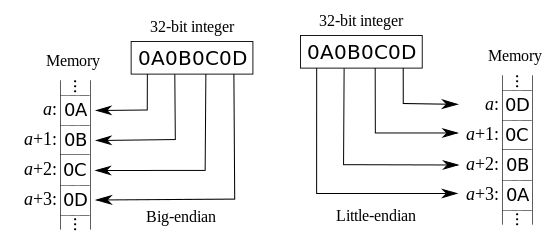

# 计算机组成

**笔记中的“透明”均指用户不可见，而非“公开的”。**

计算机体系结构是指那些能够被程序员所见到的计算机系统的属性。计算机组成是指如何实现计算机体系结构所描述的属性。

## 一、概述

### 常识与概念

- 计算机系统由计算机硬件、计算机软件和数据组成。

- 计算机按照应用进行分类：个人计算机 PC、服务器 Server、嵌入式计算机。

- 计算机按照指令和数据流可以分为：

  - 单指令流和单数据流系统（SISD），传统冯·诺依曼机；
  - 单指令流和多数据流系统（SIMD）
  - 多指令流和单数据流系统（MISD），不存在
  - 多指令流和多数据流系统（MIMD），多处理器和多计算机系统。

- 计算机的四代：电子管/真空管、晶体管、中小规模集成电路、超大规模集成电路。

- 组成计算机的 5 个部分：输入、输出、存储器、运算器、控制器。

- 指令体系结构：硬件和底层软件之间的接口，简称为**体系结构**。有 x86、ARM、MIPS 等。
- 机器字长：32 位系统 4 字节为 1 字，64 位系统 8 字节为 1 字（与指令集的设定有关）。一般也为寄存器的大小。机器字长、指令字长、存储字长在以前是相等的，但是现在并不一定相等。

- 对计算机性能的描述：响应时间、吞吐率。PC 用户往往更关注如何降低响应时间，而数据中心感兴趣的是吞吐率。\
  以**CPU 执行时间/CPU 时间**作为计算机性能的度量：\
  一个程序的 CPU 执行时间 = CPU 时钟周期数 $\times$ 时钟周期时间 = CPU 时钟周期数 $/$ 时钟频率 \
  CPU 时钟周期数 = 程序的指令数 $\times$ CPI \
  综上，CPU 时间 = 指令数 $\times$ CPI $/$ 时钟频率，其中，CPI 表示执行每条指令所需的时钟周期数的平均值。

- **MIPS**每秒执行多少百万条指令；**MFLOPS** 每秒执行多少百万次浮点运算。

- 大端法与小端法

  - 大端法：数据的高位存放在地址的低位处；
  - 小端法：数据的高位存放在地址的高位处。
    

- 软件可分为系统软件和应用软件。系统软件有操作系统、编译程序、加载程序、汇编程序、数据库管理系统、分布式软件系统、网络软件系统等。注意数据库系统包含数据库管理系统、数据库、数据库管理员和应用系统等，不是一个系统软件。

- 存储程序：存储程序指将指令以代码的形式事先输入到计算机主存储器中，然后按其在存储器中的首地址执行程序的第一条指令，以后就按照该程序的规定顺序执行其它指令，直至程序执行结束。早期的冯诺依曼机以运算器为中心，现代计算机已经发展为以存储器为中心。
- 区分存储器中的数据和指令：通过不同时段来区分或者通过地址来源区分。

- 机器语言--汇编（assembly）语言--高级语言

### 理论

#### 计算机系统结构中的八个伟大思想：

- 面向摩尔定律的设计：在设计芯片时就需要考虑该芯片产品投入市场时必须满足摩尔定律，否则将丧失市场竞争力。
- 使用抽象简化设计：对于复杂的系统设计时进行分层，化整为零。
- 加速大概率事件
- 通过并行提高性能
- 通过流水线提高性能
- 通过预测提高性能
- 存储器层次
- 通过冗余提高可靠性
