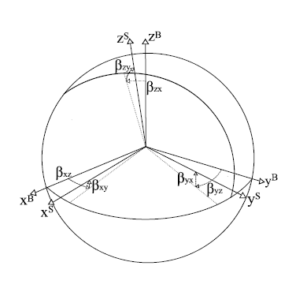

# IMU模型和标定

### IMU模型

这里以MEMS IMU为建模对象，可能不适用于其他技术制作的IMU器件。

IMU的数学模型需要考虑三个坐标轴的偏差、刻度因数、零偏、白噪声。

- IMU中的加速度计和陀螺仪都是三自由度的传感器，实际生产中无法将三坐标轴做到完全正交，这种坐标轴的偏差会影响测量结果，需要进行修正。有些文献中将其称为安装误差。
- 刻度因数是指IMU运行中返回的数据与真实数据不一致，但存在一种比例关系，这是由于标注的刻度不准确导致的，需要修正。
- 零偏是指传感器在静置时读数不为零的现象，需要修正。
- 白噪音是测量中始终存在的噪声，需要使用一些数学方法尽量降低这类误差。相关的概念是随机游走。

这里的IMU的数学模型使用 (Tedldi, 2014) 中的模型，其中坐标轴偏差、刻度因数、零偏可以在标定时确定，白噪声需要在测量时修正。出于之后对IMU的参数进行标定的需要，这里**优先建立加速度计数学模型中的坐标系**：记加速度计数学模型的坐标系为AOF。

- 以加速度计的 $x$ 轴作为AOF的 $x$ 轴；
- 在加速度计的 $xy$ 平面上选取AOF的 $y$ 轴；
- 根据AOF的 $x,y$ 轴建立其 $z$ 轴。

因此对坐标轴的调整可以描述如下，

$$
\mathbf{a}^O = \mathbf{T}^a \mathbf{a}^S, \quad \mathbf{T}^a = \left[\begin{matrix} 1 & -\alpha_{yz} & \alpha_{zy} \\ 0 & 1 & -\alpha_{zx} \\ 0 & 0 & 1 \end{matrix}\right]
$$

其中$*^O$表示实际值，$*^S$表示测量值，下同。

**陀螺仪数学模型**的坐标系GOF应该同AOF相同，对其的调整描述如下：

$$
\mathbf{\omega}^O = \mathbf{T}^g \mathbf{\omega}^S, \quad \mathbf{T}^g = \left[\begin{matrix} 1 & -\gamma_{yz} & \gamma_{zy} \\ \gamma_{xz} & 1 & -\gamma_{zx} \\ -\gamma_{xy} & \gamma_{yx} & 1 \end{matrix}\right]
$$

注意两个描述偏差的矩阵是不同的。

传感器三轴的刻度因数、零偏和白噪声往往是不同的，刻度因数描述如下：

$$
\mathbf{K}^a = \left[\begin{matrix} s^a_x & 0 & 0 \\ 0 & s^a_y & 0 \\ 0 & 0 & s^a_z \end{matrix}\right], \quad \mathbf{K}^g = \left[\begin{matrix} s^g_x & 0 & 0 \\ 0 & s^g_y & 0 \\ 0 & 0 & s^g_z \end{matrix}\right]
$$

零偏描述如下：

$$
\mathbf{b}^a = \left[\begin{matrix} b^a_x \\ b^a_y \\ b^a_z \end{matrix}\right], \quad \mathbf{b}^g = \left[\begin{matrix} b^g_x \\ b^g_y \\ b^g_z \end{matrix}\right]
$$

白噪声的描述如下：

$$
\mathbf{\nu}^a, \quad \mathbf{\nu}^g
$$

综上所述，完整的加速度计数学模型可以表述为：

$$
\mathbf{a}^O = \mathbf{T}^a \mathbf{K}^a (\mathbf{a}^S + \mathbf{b}^a + \mathbf{\nu}^a)
$$

完整的陀螺仪数学模型可以表述为

$$
\mathbf{\omega}^O = \mathbf{T}^g \mathbf{K}^g (\mathbf{\omega}^S + \mathbf{b}^g + \mathbf{\nu}^g)
$$

模型中的白噪声是高斯白噪声，即其分布为高斯分布的噪声，以陀螺仪为例，$E[v^g] = 0, Var[v^g] = \sigma_g$，$\sigma_g$ 为高斯白噪声的方差，离散化后会有 $v^g_k = \sigma_{gd} n[k]$，其中 $\sigma_{gd} = \frac {\sigma_g} {\sqrt \Delta t}, n[k] \sim N(0,1)$。问题在于如何确定高斯白噪声的方差，在IMU静置时，求取零偏的同时求白噪声的方差。具体的白噪声离散模型可以参见IMU测量模型，这里的方差作为后续滤波中使用。 

### IMU标定方法

IMU的标定方法有很多种，这里介绍 (Tedaldi, 2014) 的标定方法。

根据上述的加速度计模型，记 $\mathbf{\theta}^a = [\alpha_{yz}, \alpha_{zy}, \alpha_{zx}, s^a_x, s^a_y, s^a_z, b^a_x, b^a_y, b^a_z]$，则

$$
\mathbf{a}^O = h(\mathbf{a}^S, \mathbf{\theta}^a) = \mathbf{T}^a \mathbf{K}^a (\mathbf{a}^S + \mathbf{b}^a + \mathbf{\nu}^a)
$$

当IMU静置时，加速度计的读数应为当地的重力加速度。通过其它渠道获得当地的重力加速度 $\mathbf{g}$，记

$$
\mathbf{L}(\mathbf{\theta}^a) = \displaystyle \sum^M_{k=1}(||\mathbf{g}||^2 - ||h(\mathbf{a}^S_k, \mathbf{\theta}^a)||^2)^2
$$

求使 $\mathbf{L}$ 最小的参数向量即为加速度计的参数。

测定加速度计的参数后，借助加速度计标定陀螺仪。

首先假定陀螺仪各轴的零偏不相关，通过静置时陀螺仪的读数求取各轴的零偏，注意已经设定陀螺仪数学模型的坐标轴方向与加速度计取相同方向。

对于零偏外的其它参数，与加速度计的标定相似，记 $\mathbf{\theta}^g = [\gamma_{yz}, \gamma_{zy}, \gamma_{xz}, \gamma_{zx}, \gamma_{xy}, \gamma_{yx}, s^a_x, s^a_y, s^a_z]$，则

$$
\mathbf{\omega}^O = h(\mathbf{\omega}^S, \mathbf{\theta}^g) = \mathbf{T}^g \mathbf{K}^g (\mathbf{\omega}^S + \mathbf{b}^g + \mathbf{\nu}^g)
$$

注意这里零偏 $\mathbf{b}$ 已经标定了。依次进行如下步骤：

1. 静置IMU，记录其加速度计测得的重力加速度，假定此时为 k-1 时刻；
2. 对IMU进行一次任意的旋转，读取陀螺仪读数；
3. 静置IMU，再次记录加速度计测得的重力加速度，假定此时为 k 时刻。

根据步骤1、2可以计算得到一个 k 时刻的重力加速度。记 $\mathbf{u}$ 为重力加速度，其中 $\mathbf{u}^a$ 为使用加速度计测量的重力加速度；$\mathbf{u}^g$ 为使用陀螺仪的读数与 k-1 时刻的重力加速度计算获得的 k 时刻的重力加速度，计算过程如下：

$$
\mathbf{u}^g_k = \Psi(\mathbf{\omega}^O, \mathbf{u}^a_{k-1})
$$

根据步骤3可以直接使用加速度计测量得到一个 k 时刻的重力加速度，$\mathbf{u}^g_k$ 与 $\mathbf{u}^a_k$ 应相同或接近。记

$$
\mathbf{L}(\mathbf{\theta}^g) = \displaystyle \sum^M_{k=2}||\mathbf{u}^a_k - \mathbf{u}^g_k||^2
$$

求使 $\mathbf{L}$ 最小的参数向量即为陀螺仪的其它参数。

以上描述的标定步骤，都需要进行多次以消除数据中的白噪声。其中标定陀螺仪零偏时需要读取多次求均值；标定加速度计和陀螺仪其它参数时，从公式中可以看出需要重复 $M$ 次。具体的标定实验步骤结合实际需要和论文编制。

标定的具推荐：

- IMU与相机标定：Kalibr，其wiki中有详细介绍。

- IMU内参标定工具：imuz_tk

  

##### 参考文献

*Tedaldi, D., et al. (2014). A robust and easy to implement method for IMU calibration without external equipments. 2014 IEEE International Conference on Robotics and Automation (ICRA), IEEE.*
