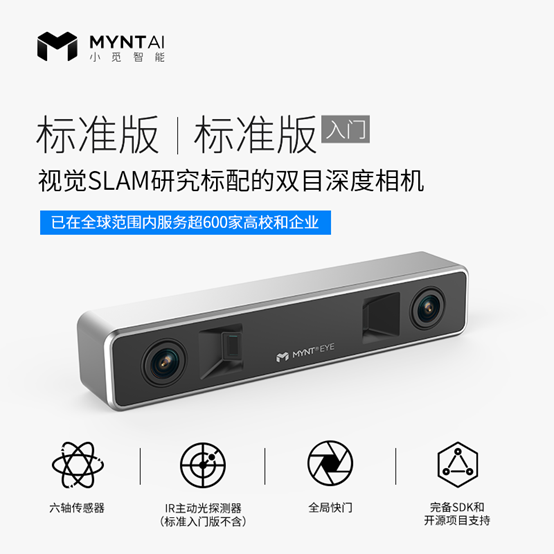

## 实验设备器材的选择

### 硬件选配

##### 1 小觅 MYNT EYE S 双目摄像头标准版（入门）— 采集数据

集成双目摄像头和IMU，其中摄像头为752×480@60fps的黑白摄像头，IMU的采样频率最高为500Hz，输出数据为原始数据，提供SDK。缺点是无法改变基线长度，价格￥999。

##### 2 使用树莓派等类似硬件+摄像头+IMU — 采集数据

树莓派可以安装linux系统，同时可以根据需要扩展双目摄像头和IMU等，相比成品更加灵活。缺点是需要自己搭建平台，需要制作固定安放摄像头和IMU的支架或外壳。项目书中指定的IMU为ICM-20602，Camera为OV7251。

##### 3 VR头显 — 用于获取对比的位姿

用于获取位姿的真实值，来对实验算法的精度进行比较。目前精度最高的获取真实位姿信息的工具价格非常昂贵，如徕卡的激光跟踪仪。使用相对较好的VR头显或其他设备获取相对较为准确的位姿信息，以用于计算算法的误差。北航青岛研究院搭建测试平台，此功能暂不考虑。

