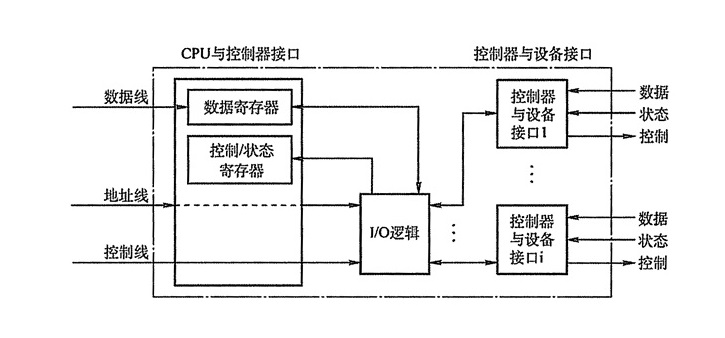

## 五、I/O管理

### 1. I/O管理概述

#### I/O设备

按使用特性可以分为人机交互类外部设备、存储设备、网络通信设备。按传输速率分为低速设备（鼠标键盘）、中速设备（打印机）、高速设备（磁盘）。按信息交换的单位分类分为块设备、字符设备。

#### I/O控制方式

-   程序直接控制方式

    CPU循环检查I/O设备的状态，这种方式下造成了CPU资源的浪费。

-   中断驱动方式

    允许I/O设备主动打断CPU的运行并请求服务，使得CPU无须浪费资源来监控I/O设备的状态。

-   DMA方式

    高速I/O设备与内存直接建立数据通路，以块为单位交换数据，解放CPU。CPU只需启动DMA和DMA结束时参与，节省了CPU资源。

-   通道控制方式

    I/O通道指专门负责输入输出的处理机，CPU需要进程I/O操作时，只需要向I/O通道发送一条I/O指令即可。

#### I/O子系统的层次结构

整个I/O系统可以看成具有四个层次的系统结构，各层次如下：

- 用户层I/O软件：实现与用户交互的接口，用户可以直接调用在用户层提供的、与I/O操作有关的库函数。

- 设备独立性软件：用于实现用户程序与设备驱动器的统一接口、设备命令、设备保护、以及设备分配与释放等，同时为设备管理和数据传递提供必要的存储空间。

    为了实现设备独立性而引入了逻辑设备和物理设备两个概念，在应用程序中使用逻辑设备名来请求使用某类设备；系统实际执行中必须将逻辑设备名映射成物理设备名使用。使用逻辑名的好处是增加设备分配的灵活性，易于实现I/O重定向（更换I/O设备，但不必改变应用程序）。

    设备独立性软件主要功能可分为以下两个方面：执行所有设备的公有操作；向用户层或文件层提供统一接口。

    设备驱动程序：与硬件直接相关，负责具体实现系统对设备发出的操作命令，驱动I/O设备工作的驱动程序。

- 中断处理程序：用于保存中断进程的CPU环境，转入相应的中断处理程序进程处理；处理完并恢复被中断进程的现场后，返回被中断的进程。

- 硬件设备：硬件设备包括设备本身和设备控制器，设备控制器的主要功能为：

    -   接收和识别CPU或通道发来的命令。
    -   实现数据交换，包括设备和控制器之间的数据交换；通过数据总线或通道，控制器和主存之间的数据传输。
    -   发现和记录设备及本身的状态信息。
    -   设备地址识别。

    为实现上述功能，设备控制器包含以下组成部分：

    -   设备控制器与CPU的接口：三类信号线-数据线、地址线和控制线；两类寄存器-数据寄存器和控制/状态寄存器。
    -   设备控制器与设备的接口。
    -   I/O控制逻辑：对从CPU收到的I/O命令进行译码。

    具体结构如下：

    

### 2. I/O核心子系统

I/O子系统是操作系统内核的一部分，提供的服务主要有：I/O调度、缓冲与高速缓冲、设备分配与回收、假脱机、设备保护和差错处理等。

#### I/O调度

I/O调度就是确定一个好的顺序来执行I/O请求，以改善系统的整体性能，使进程之间公平地共享设备访问。操作系统为每个I/O设备维护一个请求队列来，通过重新安排队列的顺序以改善系统总体效率和应用程序的平均响应时间。

#### 高速缓存与缓冲区

##### 磁盘高速缓存

操作系统通过使用磁盘高速缓存技术来提高磁盘的I/O速度，具体是指利用内存中的存储空间来暂存从磁盘中读出的一系列盘块中的信息，其逻辑上属于磁盘，物理上属于内存。

##### 缓冲区Buffer

缓冲区的主要目的：

-   缓和CPU和I/O设备间的速度不匹配的矛盾。
-   减少对CPU的中断频率，放宽对CPU中断响应时间的限制。
-   解决基本数据单元大小（数据粒度）不匹配的问题。
-   提供CPU和I/O设备之间的并行性。

实现方法有：

-   采用硬件缓冲器。
-   采用位于内存中的缓冲区。

根据系统设置的缓冲区的个数，缓冲技术可以分为：

-   单缓冲

    在设备和处理机之间设置一个缓冲区，两者之间交换数据时，先将数据放入缓冲区然后需要数据的设备或处理机从缓冲区取走数据。

-   双缓冲

    在设备和处理机之间设置两个缓冲区，两个缓冲区交替工作，避免了传送大量数据时的等待时间。两个缓冲区还可以实现双向数据传输。

-   循环缓冲

    多个大小相等的缓冲区组成一个循环的链表，设备和处理机交换数据时，缓冲区链表按顺序使用，避免了设备等待缓冲区变空的时间。

-   缓冲池

    由多个公用的缓冲区组成，按其使用情况可分为三个队列：空缓冲队列、装满输入数据的缓冲队列、装满输出数据的缓冲队列；还有四种缓冲区：用于收容输入数据的工作缓冲区、用于提取输入数据的工作缓冲区、用于收容输出数据的工作缓冲区、用于提取输出数据的工作缓冲区。

    当输入进程需要输入数据时，从空闲缓冲队列的对首摘取一个空缓冲区，把它作为收容输入数据的工作缓冲区，然后把输入数据放入其中，装满后再将它挂到输入队列队尾。其它的情况类似。

#### 设备分配与回收

##### 设备分配

从设备的特性来看，设备分配采用以下三种方式：

-   独占式使用设备：对应独占设备，一次只允许一个进程使用，等该设备被释放后才允许其它进程申请使用。如打印机。
-   分时式共享使用设备：对应共享设备，通过分时共享提高设备的利用率。如磁盘。
-   以SPOOLing方式使用外部设备：对应虚拟设备，SPOOLing技术为假脱机I/O技术，实质就是对I/O操作进行批处理。

设备分配相关的**主要数据结构**有设备控制表DCT、控制器控制表COCT、通道控制表CHCT、系统设备表SDT。

-   DCT：一个设备控制表代表一个设备，其中的表项就是设备的属性。每个设备控制表中都有一个表项存放指向对应控制器控制表的指针。
-   COCT：采用通道控制方式的系统中，每个控制器控制表都有一个表项存放指向相应通道控制表的指针。
-   CHCT：一个通道可以为多个设备控制器服务，因此通道控制表中都有一个指针指向一个表，这个表上记录了该CHCT提供服务的设备控制器。
-   SDT：整个系统只有一个系统设备表，它记录了已链接到系统中的所有物理设备的情况。

设备**分配方式**分为静态分配和动态分配。静态分配指作业开始工作前，系统将其申请的所有设备、控制器一次性全部分配给该作业，一旦分配这些设备、控制器就一直为该作业所有，直到作业被撤销。动态分配是进程在执行过程中根据需要申请分配，用完后立即释放；常用的动态设备分配算法有先请求先分配、优先级高者先分配等。

静态分配不会造成死锁，动态分配会造成死锁。

设备分配的**安全性**指设备分配中应防止发生进程死锁。安全的分配方式是每当进程发出I/O请求后便进入阻塞状态；不安全的分配方式是进程发出I/O申请后继续执行，需要时由发出第二个、第三个请求等。

为了实现设备的独立性，在应用程序中使用逻辑设备名请求某类设备，在系统中设置一张逻辑设备表LUT，用于将逻辑设备名映射成物理设备名。逻辑设备表中每个表项包含逻辑设备名、物理设备名和设备驱动程序入口地址。系统中可以采用两种方式建立逻辑设备表：在整个系统中设置一张逻辑设备表、为每个用户设置一张逻辑设备表。

#### SPOOLing技术

SPOOLing技术是一种将独占设备改造成共享设备的技术。

在磁盘上设置两个存储区域：输入井和输出井。输入井模拟脱机输入时的磁盘，用于收容I/O设备输入的数据；输出井模拟脱机输出时的磁盘，用于收容用户程序的输出数据。

在内存中设置两个缓冲区：输入缓冲区和输出缓冲区。输入缓冲区用于暂存输入设备送来的数据，以后再传送到输入井；输出缓冲区用于暂存输出井送来的数据，以后再传送到设备。

输入进程将用户要求的数据从输入机通过输入缓冲区再送到输入井，当CPU需要输入数据时，从输入井直接读入内存。输出进程把用户要求输出的数据先从内存送到输出井，待输出设备空闲，再将输出井中的数据通过输出缓冲区送到输出设备。

SPOOLing技术提高了I/O的速度，将独占设备改造成共享设备，实现了虚拟设备功能。