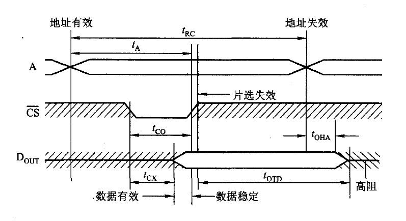
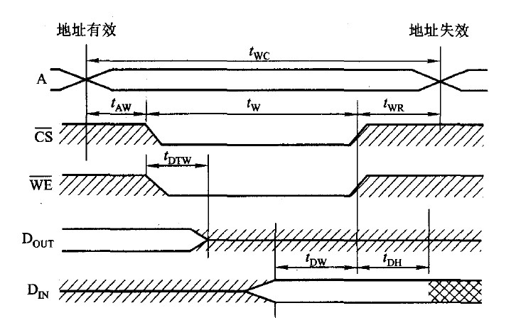

## 四、存储器

### 1.概述 

#### 存储器的分类

-   按照存储介质，可分为

    -   磁表面存储器：磁盘、磁带
    -   磁芯存储器
    -   半导体存储器：双极型（TTL）存储器、MOS型存储器
    -   光存储器：光盘

-   按照存取方式，可分为

    -   随机存储器（RAM）：存储器中的任何一个存储单元的内容都可以随机存取，存取时间与存储单元的物理位置无关。又可分为静态随机存储器SRAM、动态随机存储器DRAM。

    -   只读存储器（ROM）：存储器中的内容只能读出，不能写入，通常用于存放固定不变的程序、常数、字库等。只读存储器和随机存储器可共同作为主存的一部分（主要的部分是随机存储器），统一构成主存的地址域。

    -   串行访问存储器：存储器按照其物理地址的先后顺序寻址，进行读写操作，包括顺序存取存储器（每次都必须从始端开始按顺序寻址，如磁带）、直接存取存储器（可以首先指出存储器中的某个小区域，然后再顺序寻址，如磁盘）。

-   按照在计算机中的作用，可分为

    -   主存储器：可以被CPU直接访问，也可以和高速缓冲存储器Cache、辅助存储器交换数据。
    -   辅助存储器：又称外存储器，作为主存储器的后援存储器。
    -   高速缓冲存储器Cache：位于CPU和主存之间，用来缓和CPU和主存之间的速度差异。Cache和CPU的速度相当，但造价高，容量小，一般制作在CPU中。

-   按照信息的可保存性，可分为

    -   易失性：即断电后信息就消失，如RAM。
    -   非易失性：断电后信息不会消失，如ROM、磁表面存储器、光存储器。

#### 存储器的性能指标

存储器有3个主要性能指标，即存储容量、单位成本、存储速度。

-   存储容量
-   单位成本：使用每位价格表示，等于总成本/总容量。
-   存储速度
    -   存取时间：存储器从启动一次存储操作到完成该操作所经历的时间，分为读出时间和写入时间。
    -   存取周期：存储器进行一次完整的读写操作所需的全部时间，即连续两次独立地访问存储器操作之间所需的最小时间间隔，存储周期包含存取时间、恢复时间。
    -   主存带宽：又称数据传输率，每秒从主存进出信息的最大数量，单位B/s。

#### 存储器的层次结构

寄存器--高速缓存--主存--辅存。按照顺序速度降低，容量升高，单位成本降低。

早期的CPU直接访问主存，但是CPU发展速度比主存技术的发展速度快很多，主存的速度逐渐无法匹配CPU，因此在CPU和主存之间增加了一级高速缓存，现在有多级的高速缓存解决CPU与主存速度不匹配的问题。**高速缓存Cache与主存之间的数据调动是由硬件和操作系统共同完成的，对应用程序员是透明的。**

### 2. 半导体存储器

半导体存储器采用超大规模集成电路制造工艺，集成有存储矩阵、译码驱动电路、读写电路等。

-   存储矩阵由大量相同的位存储单元阵列构成。
-   译码驱动电路将来自地址总线的地址翻译成对于存储单元的选通信号。有线选法（每次选中一字）和重合法（每次选中一位）两种。
    -   线选法：每次访问一个字，字间线性排列。
    -   重合法：存储单元分布于一个二维地址空间，即把地址分成行列两部分，每次访问一个位。
-   读写电路包含读出放大器和写入电路，用来实现读写操作。
-   地址线是单向输入的，数据线是双向的。若地址线$a$根，数据线$d$根，则其容量为$2^a \times d$位。
-   控制线主要有读写控制线（共用1根或者分用两根）和片选线。片选线用于多个芯片的存储器选中某片芯片。

#### 随机存储器 SRAM与DRAM

##### SRAM

SRAM的存储单元是由触发器构成的，每个存储单元需要6个MOS管构成，触发器在信息被读取之后仍能保持其原状态，不需要再生，故称为静态。但是电源切断后，保存的信息便会丢失。

SRAM存取速度快，但集成度低、功耗较大，一般用于高速缓冲存储器。

##### DRAM

DRAM的存储单元是由栅极电容构成的，利用栅极电容存储信息，有三管式和单管式。电容上的电荷一般只维持1～2ms，必须每隔一定时间刷新，称为刷新周期（存取周期远远小于刷新周期，刷新周期一般取2ms，存储周期则以$\mathrm{\mu s}$记，如0.5$\mathrm{\mu s}$）。电源切断后，保存的信息丢失。DRAM通常采用地址复用，即行列地址用同一地址线，地址信号分行列两次传送。

DRAM的刷新是先将原有信息读出，再由刷新放大器形成原信息重新写入。有以下三种刷新方法。

-   集中刷新：在一个刷新周期内，利用一段固定的时间，对全部存储单元集中逐行刷新。刷新时必须停止读写操作，这段时间被称为“死时间”/“死区”。取刷新周期2ms，存储周期$0.5 \mathrm{\mu s}$，刷新时间为$0.5 \mathrm{\mu s}$，存储器有128行，则死时间为$128 \times 0.5 \mathrm{\mu s} = 64 \mathrm{\mu s}$；其余时间用来进行读写操作。（刷新时间和读取周期相同，是因为二者在硬件操作上相似。）

-   分散刷新：把对每一行的刷新分散到每个存取周期中，即将存取周期分为两部分：前半段用于存取，后半段用于刷新。每次刷新只刷新一行。尽管不存在死时间，但是每个工作周期变长，整体工作效率降低。

-   异步刷新：前两种方式的结合，多个存取周期后添加1次刷新组成一次循环，每次循环只刷新一行，这样2ms内的包含总行数次的循环，依次逐行刷新各行，对于每行来说刷新间隔仍为2ms，死区时间缩短为一。

    （将异步刷新的刷新时间安排在CPU的译码阶段，就不会影响DRAM的读写。）

DRAM相对于SRAM，具有集成度更高、功耗更低等特点，用于组成大容量主存系统。

##### 随机存储器的读、写周期

1.  读周期
    -   读出时间：从给出有效地址到读出所选中单元的内容并在外部数据总线上稳定地出现所需的时间。
    -   读周期：存储芯片连续两次读取操作时所必须的时间间隔。它总是大于或等于读出时间。
    -   如下图，先形成地址信号，后片选信号生效，开始读取数据；数据稳定输出后片选信号立即失效；地址失效后数据信号仍维持一小段时间，以保证所读数据的可靠。

    
2.  写周期
    -   如下图，先形成地址信号，后片选信号和写命令信号变为低电平，开始写入数据；数据写入稳定一段时间后，片选信号和写命令信号失效，后地址失效。在地址信号变化时保证写命令信号为高电平，防止错误写入。

    

#### 只读存储器ROM

只读存储器支持随机读取，SRAM和DRAM是易失性存储器，但是ROM是非易失性存储器。ROM不考虑重复写入，因此在设计上结构简单，位密度高，更加可靠。

##### ROM类型

-   掩模型只读存储器MROM：在芯片制作中写入，写入后无法更改。集成度高、价格便宜。
-   一次可编程只读存储器PROM：允许用户用专门的设备（编程器）写入自己的程序，一旦写入内容就无法更改。
-   可擦除可编程只读存储器EPROM：用户可以利用编程器写入信息和有限多次改写信息。EPROM有两种：紫外线擦除UVEPROM和电擦除EEPROM。
-   闪速存储器Flash Memory：可以快速擦除与重写，在不加电的情况下长期保存信息。
-   固态硬盘SSD：用固态电子存储芯片阵列而制成的硬盘，保留了Flash Memory的特性。相对于传统硬盘有读写速度快、功耗低的特点。

### 3. 主存

现代计算机的主存都由半导体集成电路构成，存储芯片通过数据总线、地址总线、控制总线与CPU相连。

-   数据总线的位数与工作频率的乘积正比于数据传输率。
-   地址总线的位数决定了可寻址的最大主存空间，并不一定是实际的主存容量。
-   控制总线（读/写）指出总线周期的类型和本次输入输出操作完成的时刻。

当CPU要从存储器中读取某一信息字时，由CPU将该字的地址送入MAR，经地址总线送至主存，然后发出读命令；主存接到读命令后，将该地址对应单元的内容读出，送至数据总线上，该信息送至MDR。至于MDR会送数据去哪里，主存不需要关注，由CPU决定。MAR、MDR均位于CPU内。

主存的校验采用汉明码校验。

#### 主存容量的扩展

单片存储芯片的容量有限，实际中会将若干存储芯片连在一起使用，称为存储容量的扩展。

##### 位扩展法

位扩展是增加存储的字长，以匹配CPU的数据总线的宽度。如8片$1K \times 1$位的RAM芯片组成$1K \times 8$位的存储器，地址总线、控制总线并联，数据总线每一片对应连一根（一位），因此一地址对应的一字8位，实际分布在这8片芯片的相同物理位置。

##### 字扩展法

字扩展不改变字长，而是增加字的数量。如4片$16K \times 8$位的RAM芯片组成$64K \times 8$位的存储器，地址总线、数据总线、控制总线都并联，一般地址的高位部分构成片选信号。

##### 字位同时扩展法

字和位同扩展，既增加存储字的容量，也增加存储字长。

#### 主存与CPU的连接

##### 地址总线的连接

采用字扩展法的主存，地址总线在各存储芯片之间并联，根据每片存储芯片的容量决定片内地址线的位数（地址总线的低位），根据存储芯片的数量决定片选线的位数（地址总线的高位）。地址总线中片选线的连接方法有两种：线选法、译码片选法。

-   线选法：地址总线用于片选的高位直接有芯片的片选线相连，每一片需要一根地址线作为片选信号。
-   译码片选法：地址总线用于片选的高位通过一个译码器与芯片的片选线相连，如3-8译码器，使用3位地址线作为片选可以产生8位片选信号，节省地址线。

位扩展法的主存，将其扩位成字长的存储器看作1片存储芯片，再按字扩展法处理。

##### 数据总线的连接

CPU的数据线与存储芯片的数据线数量相等时，可以直接连接；不相等时，需要先进行位扩展，使其与数据线数量相等。

##### 读/写命令线的连接

CPU的读命令线应该与存储芯片的允许读控制端相连，CPU的写命令线与存储芯片的允许写控制端相连。

##### 片选线的连接

只有当CPU要求访存时，才需要选中存储芯片，因此片选线的信号还应与CPU的访存控制信号$\mathrm{\overline{MREQ}}$（低电平有效）有关。

##### 合理选择存储芯片

通常ROM存放系统程序、标准子程序和各类常数，RAM为用户编程而设置的。考虑芯片时，尽量使连线简单、方便。

#### 提高CPU访存速度的方法

CPU的速度比存储器快，需要提高访问存储器的速度。可以采用双端口存储器（空间并行）、多模块存储器（时间并行）等技术。除此之外，还有猝发式读取、更新技术的存储芯片等。

##### 双端口RAM

双端口RAM在同一个存储器的左右两个端口，具有两组独立的地址线、数据线和读写控制线，允许两个独立的控制器（如两个CPU核心）**同时异步**地访问存储单元。两各控制器可以同时对不同地址的存储单元进行**存取**，同时对同一地址的存储单元进行**读取**，不同时对同一地址的存储单元进行写入。其它情况下可能会引发错误，在芯片上增加一”忙“信号，可以暂时地关闭一侧的端口，避免两个端口同时写入同一存储单元造成错误。

##### 多模块存储器

-   单体多字系统

    存储器只有一个存储体，每个存储单元存储$m$个字，总线宽度也为$m$个字。在一个存取周期内一次并行地读出连续的$m$个字，然后逐条将指令送入CPU执行，即每隔$1/m$存取周期，CPU向主存取一条指令。

    这样增大了存储器的带宽，提高了存储器的工作效率。但是要求指令和数据在主存中必须连线存放，一旦遇到转移指令或操作数不连续存放，这种方法的效果不明显。

-   多体并行系统

    存储器由多个存储模块组成，每个模块都有相同的容量和存取速度，都有独立的读写控制电路、地址寄存器和数据寄存器。它们既能并行工作，又能交叉工作。

    -   高位交叉编址（顺序方式）：高位地址为体号，低位地址为体内地址。这样每个存储体内的存储单元是按照顺序排列的。

    -   **低位交叉编址**（交叉方式）：低位地址为体号，高位地址为体内地址，来形成存储单元在多个存储模块间交叉出现。每个存储模块内的存储单元是按特定间隔（存储模块数）排列的，相邻地址对应的存储单元位于不同的存储模块。

        当CPU访问连续的地址时，多个存储模块在不改变存储周期的前提下，**以流水线的方式并行存取**，提高了存储器的带宽。

    多体模块结构的存储器多采用低位交叉编址，设有$m$个存储模块，每个模块的存取周期都为$T$，总线的传输周期为$r$（$T \gt r$），因此只需要将交叉的多个存储模块按$r$进行延时启动即可。这样连续存取$m$个字（全部模块访问一遍）的总时间为$t = T + (m - 1)r$。

    若采用高位交叉编址，即顺序编址，连续存取$m$个字的时间为$t = mT$，可见低位交叉编址可以大大提高存储器的带宽。

### 4. 高速缓存Cache

#### 程序访问的局部性原理

由于指令和数据在主存中是连续存放的，CPU从主存中取指令或取数据时，在一定的时间内只对主存局部地址区域进行访问。这被称为程序访问的局部性原理。

-   时间局部性：当某一地址的内容被CPU访问后的一段时间，该地址的内容极有可能被访问。
-   空间局部性：当某一地址的内容被CPU访问后，该地址附近的其他地址极有可能被访问。

高速缓存Cache使用程序访问的局部性原理提高CPU的访存。

#### 高速缓存Cache的工作原理

将Cache和主存都分成若干大小相等的快，每块由若干字节组成。由于Cache的容量远小于主存的容量，所以Cache中块数要远少于主存的块数，它仅保存主存中最活跃的若干块的副本。

当CPU发出读请求时，

-   如果访存地址在Cache命中，就将此地址转化成Cache地址，直接对Cache进行读操作，与主存无关；
-   如果Cache不命中，则需访问主存内，并**将该字所在的块一并从主存调入Cache内**。若Cache已满，根据**替换算法**，用这个块替换掉Cache中的某块。

当CPU发出写请求时，如果访存地址在Cache命中，可能会遇到Cache与主存中的内容不一致的问题，需要按照一定的写策略，更新主存中的内容。

##### 命中率

设一个程序执行期间，访问主存的次数为$N_m$，Cache命中的次数为$N_c$，则命中率$H = N_c / (N_m + N_c)$。命中率越高越好。

设Cache未命中时的访存时间为$t_m$，Cache命中时的访存时间为$t_c$，则Cache-主存系统的平均访存时间为$T = Ht_c + (1-H)t_m$。

#### 高速缓存Cache与主存的映射方式

由于Cache中的块数比主存块数少得多，这样主存中只有一部分块的内容可放在Cache中，Cache上每一个块都有一个标记，指明它是主存中的哪一块，还设置了一个有效位表明该标记是否有效。

##### 直接映射

设Cache有$2^c$个块，主存上块标记为$j = i \  \mathrm{mod} \ 2^c$，其中$i$为块号。此时主存上的每个块都有唯一对应的Cache块，若这个Cache块上已经有内容，原来的块将无条件地被替换出去。直接映射实现简单，但不够灵活，相对其它映射方式空间利用率最低。

##### 全相联映射

可以把主存中的块装入任何Cache块，需要使用替换算法选择要替换掉的块。

全相联映射比较灵活，空间利用率高，命中率也高。缺点是地址速度变换慢，实现成本高，通常采用昂贵的按内容寻址的相联存储器进行地址映射。

#####  组相联映射

将Cache中的全部块分成大小相同的组，主存的一个数据块可以装入到**一组内**的任何一个位置，即组间采用直接映射，组内采取全相联映射，是直接映射和全相联映射的一种折中。这里需要选择合适的组数。

#### Cache替换算法

采用全相联映射和组相联映射方式，需要替换算法。常用的替换算法有随机算法（RAND）、先进先出算法（FIFO）、近期最少使用算法（LRU）和最不经常使用算法（LFU）。

-   随机算法RAND：随机地确定要替换的Cache块，命中率比较低。实现比较简单。
-   先进先出算法FIFO：选择最早装入Cache的块，没有依据程序访问的局部性原理。
-   近期最少使用LRU：根据局部性原理选择最近时间内长久未访问过的Cache块。LRU算法对每块设置一个计数器，每命中一次，该块计数器清零，其它块计数器加一；替换时选择计数值最大的块。
-   最不经常使用的算法LFU：根据局部原理选择最近内长久未访问过的Cache块。LFU算法对每块设置一个计数器，每访问一次，该块计数器加一；需要替换时选择计数值最小的块。

#### Cache写策略

当对Cache中的内容进行更新，就需要将Cache内容和内存中的内容保持一致。主要有两种写操作策略：全写法和写回法。

-   全写法：当CPU对Cache写命中时，必须把数据同时写入Cache和主存。这样某一块需要替换时，不必再考虑将此块写入内存。这种方法实现简单，能随时保持主存数据的正确性。为减少全写法直接写入主存的时间损耗，在Cache和主存之间加一个写缓存。缺点是增加了访存次数，降低了Cache的效率。
-   写回法：当CPU对Cache写命中时，只修改Cache的内容，而不立即写入内存，只有当该块被换出时才写入主存。这种策略下每个Cache块必须设置一个标志位（脏位）来反映此块是否被CPU修改过。

如果CPU对Cache不命中时，还需考虑是否将此块调入Cache。

现代计算机的Cache通常设立多级Cache，此时根据需要采用两种写操作策略。

### 5. 虚拟存储器

主存和联机工作的辅存共同构成虚拟存储器，虚拟存储器对主存和辅存统一编址，使得用户不需考虑程序在存储器中的实际位置。

虚拟存储器中用户编程涉及到的地址称为虚地址/逻辑地址，实际的主存单元地址称为实地址/物理地址。CPU使用虚地址，由辅助的硬件来将虚地址映射成实地址、或将辅存中的内容装入内存后映射。

#### 页式虚拟存储器

虚拟空间和主存空间都被划分成大小相同的页，虚拟空间的页称为虚页，主存的页称为实页。此时虚拟地址分成两个部分：虚页号和页内地址。虚地址和实地址之间的变换由页表来维护，页表长期保存在主存中，页表起始地址存放在页表基址寄存器中。每个页表项记录了与某个虚页对应的虚页号、实页号、装入位等信息，若装入位为1，则表示该页已装入主存，装入位为0，则表示该页未装入主存。

CPU访存时，先要查询页表，若命中，则将页表中对应的实页号与虚地址中的页内地址拼接成完整的实地址使用；若不命中，则启动I/O系统将该页从辅存调入主存后（以及页替换和页表修改），再供CPU使用。

页式虚拟存储器的优点是页的长度固定，页表简单，调入方便。缺点是页内空间容易浪费，且页不是逻辑上独立的实体，处理、保护和共享都不及段式虚拟存储器方便。

#### 段式虚拟存储器

段式虚拟存储器中的段是按照程序的逻辑结构进行划分的，**各段的长度因程序而异**。把虚地址分成两个部分：段号和段内地址。虚地址和实地址之间的变换由段表来维护，段表项记录了某个段的段号、装入位、**段起点和段长度**。

CPU访存时，先查询段表，若装入位为1，该段已调入主存，将该段的起始地址与段内地址相加，得到对应的实地址使用；若装入位为0，则要先将该段调入主存后，再供CPU使用。

段式虚拟存储器的优点是段的长度灵活，不会造成段类空间的浪费，且段具有逻辑独立性，易于编辑、管理、修改和保护，也便于多道程序的共享。缺点是容易在段间留下碎片，造成浪费。

#### 页段式虚拟存储器

将虚地址按逻辑机构分段，每段再划分成多个固定大小的页，主存也划分成同样大小的页，程序对主存的调入、调出仍以页为单位进行。虚地址将分成三部分：段号、段内页号、页内地址。此时各段的页数量不同，页大小相同。

段页式虚拟存储器兼具页式和段式虚拟存储器的优点，缺点是要进行两次查表，系统开销大。

#### 快表TLB

依据程序执行的局部性原理，将一段时间内经常访问的某些页所对应的页表项放入高速缓存中，组成快表TLB。相应地主存中的页表称为慢表。

查表时快表和慢表是同时进行的，若快表中有此逻辑页号，就能很快找到对应的物理页号，送入主存地址寄存器，并使慢表的查找作废，这样可以明显地提高效率。

在同时具有TLB的页段式虚拟存储器和Cache的系统中，访问顺序是查询TLB和页表（获得物理地址）、查询Cache和主存（获取字）。

#### 虚拟存储器和Cache的比较

相同之处：

-   都将数据划分成小的块来作为基本的传送单位；
-   都有地址的映射、替换算法、更新策略；
-   都根据程序访问的局部性原理，将相对活跃的数据放入相对高速的部件中。

不同之处：

-   Cache用于弥补CPU与主存间的速度差异，虚拟存储器用于扩展主存的容量；
-   Cache由硬件实现，虚拟存储器由硬件和OS共同实现；Cache对程序员是透明的，但虚拟存储器对系统程序员是不透明的，对应用程序员是透明的；
-   Cache不命中时主存可以直接和CPU通信，虚拟存储器不命中是辅存不能直接与CPU通信，仍需要通过主存。

### 6. 辅助存储器

见I/O系统。

