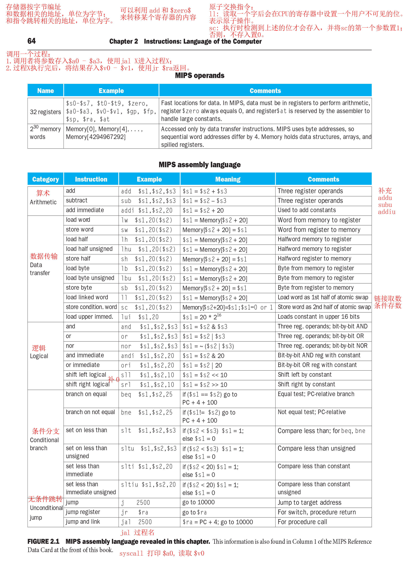

## 七、MIPS指令集

### 存储

- 32个寄存器（大小为32位）：

| 寄存器    | 寄存器号 | 功能           | 调用时是否保存 |
| :-------: | :------: | :------------: | :------------: |
| $zero     | 0        | 恒为0          |                |
| $at       | 1        | 为汇编器保留   |                |
| $v0 - $v1 | 2 - 3    | 保存返回值     | 否             |
| $a0 - $a3 | 4 - 7    | 输入参数       | 否             |
| $t0 - $t7 | 8 - 15   | 临时变量       | 否             |
| $s0 - $s7 | 16 - 23  | 保存用的寄存器 | 是             |
| $t8 - $t9 | 24 - 25  | 更多临时变量   | 否             |
| $k0 - $k1 | 26 - 27  | 为OS保留       |
| $gp       | 28       | 全局指针       | 是             |
| $sp       | 29       | 栈指针         | 是             |
| $fp       | 30       | 帧指针         | 是             |
| $ra       | 31       | 返回地址       | 是             |

- 存储器字：30位地址。

### 指令格式

- R型

    | 操作码 | 源寄存器1 | 源寄存器2 | 目的寄存器 | 位移量 | 功能码 |
    | :---: | :-------: | :------: | :-------: | :----: | :---: |
    | 6     | 5         | 5        | 5         | 5      | 6     |

- I型

    | 操作码 | 源寄存器1 | 源寄存器2 | 立即数 |
    | :---: | :-------: | :------: | :---: |
    | 6     | 5         | 5        | 16    |

- J型

    | 操作码 | 地址 |
    | :---: | :--: |
    | 6     | 26   |

### 指令

