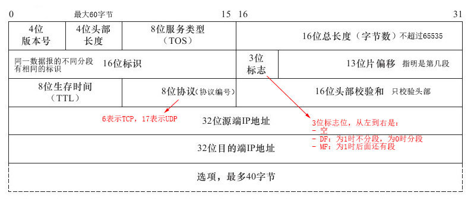
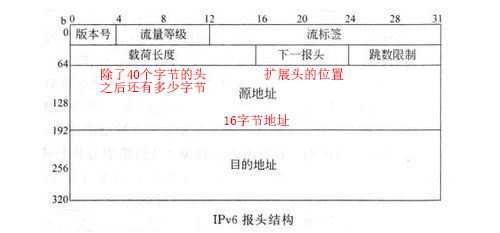

## 四、网络层

### 1.概述

网络层的功能：异构网络互连、路由选择、分组转发、拥塞控制（拥塞控制是指整个网络的拥挤程度，而不单指点对点之间）。提供无连接的数据报和面向连接的虚电路服务。

工作在网络层的设备是路由器，隔离广播域，主要功能是分组转发、路由选择。

### 2.路由算法与路由协议

路由算法可以分为静态路由算法和动态路由算法，其中静态路由算法有

- 泛洪算法：获取网络的全貌。
- 最短路径算法：在已知网络全貌的基础上，使用Dijkstra算法获取最短路径。

动态路由算法有

- 距离矢量路由算法
- 链路状态路由算法

#### 距离矢量路由算法与RIP协议

每个路由器维护一张路由表，表中每个路由器对于一个表项，包含到该路由器的首选出口和距离估计值。经过一定时间间隔每个路由器会将自己的整个路由表分享给**直接相连**的路由器。

- 接收到其他路由器的路由表后，如果某个表项比自己的对应表项距离小，用此表项更新自己的路由表；如果不存在某个路由的表项，则将此表项加入路由表。
- 在工作过程中如果某个路由不可达，只能等待与其他路由交换路由表以获取新的路由。

距离矢量路由算法总会得到收敛，但是很慢。

- 网络中的好消息传的很快，当路由器A加入网络，网络中距离A有n跳的路由器，至多经过n次路由表交换就会感知到A的存在。
- 网络中的坏消息传的很慢，当路由器A停机，其相邻的路由器B无法确定A是停机还是AB链路断了，但是B可以从另外的路由器的路由表中获取一个到A稍远的路由，这条路由表项的距离总是慢慢增加的，直到超出阈值。故坏消息传得慢。

RIP协议使用跳数描述距离，一条路径最多包含15个路由器，任意两个路由器每30秒广播一次自己的RIP路由更新信息。RIP是应用层协议，使用UDP。

#### 链路状态路由算法与开放最短路径优先协议OSPF

链路状态路由算法的过程如下：

1. 每个路由器会通过每个出口发送一个HELLO数据包，其相邻的路由器会返回一个ECHO数据包，包含路由器的名字。通过两个数据包的间隔可以为每个相邻的路由器设定一个距离估计值。
2. 路由器将刚刚获取的所有相邻路由和距离构造一个链路信息包，将这个包分享给其他所有路由，并接收所有其他路由器的链路信息包。这里的链路数据包包含序号（用于表明该包的新旧）和存活时间（控制泛洪规模）。
3. 根据接收到的链路信息包计算出到每个路由器的最短距离。使用Dijkstra算法。

OSPF的路由器每10秒交换一次HELLO数据包，每30分钟更新一次链路状态。OSPF是网络层协议，直接使用IP数据报传输数据。

#### 分层路由与边界网关协议BGP

一个自治系统内部使用的路由协议称为内部网关协议IGP，可以使用RIP或OSPF。自治系统之间使用的协议是外部网关协议EGP或边界网关协议BGP。

BGP协议使用路径矢量算法，只要找到一条较好的路由即可，不追求最好的路由。BGP首次与相邻的BGP路由器交换整个BGP路由表，之后只交换变化的部分。

BGP协议是应用层协议，使用TCP。

#### 其他

广播路由、组播路由、选播路由，用于非一对一的通信。

### 3.拥塞控制

对于拥塞的解决方案：

- 提早增加带宽和升级设备。
- 使用流量感知路由可以将流量拆分到多个路径，即选择多个较短的路由而不是一个最短的路由。
- 使用准入控制和流量调节来降低网络的负载。准入控制只允许有权限的路由器发送数据包，流量调节是接收方发送一个流量抑制包来通知源主机降低发送速率。流量抑制包可以由任何其他包捎带，称为显示拥塞通知。抑制包可以设定为对其沿途的各个路由器都有抑制作用，称为逐跳后压。
- 当没有其他解决办法时，只能丢弃无法传递的数据包，称为负载脱落。

### 4.Internet

#### IPv4数据报

IPv4数据报包含一个头部和一个正文，头部包含如下内容

校验和字段首先置零，将整个头按16位字的补码相加求和再取补码，放入校验字段。

当一个数据报超过帧的长度，需要分段。

- 一个数据报的不同分段，有相同的数据报标识，表明是一个段。
- 标志位中的DF为0，表明该数据报已经分段；除最后一段外，其他段的MF为1，表明后面还有段。
- 数据报中的载荷，按字节编号，从0开始。片偏移量中记录的该段的起始字节号/8，比如以太网帧有效载荷为1500字节，IPv4数据报头为20字节，因此第一段最长1480字节（字节编号为0~1479），第二段的第一个字节为1480，片偏移量为1480/8=158。

#### IPv4地址

##### 两级IP地址

IPv4地址由4组8位二进制组成，分为5类：

- A类：二进制开头为0，第一组是1~126；前8位是网络号，后24位是主机号。
- B类：二进制开头为10，第一组是128~191；前16位是网络号，后16位是主机号。
- C类：二进制开头为110，第一组是192~223；前24位是网络号，后8位是主机号。
- D类：二进制开头为1110，第一组是224~239，是多播地址。使用此类地址和UDP协议，实现IP组播。
- E类：二进制开头为1111，第一组是240~255，保留。

另外一些特殊的地址：

- 主机号全为0的，表示本网络自身。
- 主机号全为1的，表示本网络的广播地址。
- 127.0.0.0用于环路检测。
- 32位全0表示本网络上的本主机。
- 32位全1表示本网络的广播地址。

地址不够用，LAN用私有地址，公用一个公网地址，通过网络地址转换NAT将私有地址和公网地址的转换。有3类：

- A类：10.0.0.0~10.255.255.255
- B类：172.16.0.0~172.31.255.255
- C类：192.168.0.0~192.168.255.255

##### 子网划分

两级IP地址限制了地址空间的利用率。通过子网掩码确定IP地址的前缀，包括网络号和子网号，网络号对应上述的地址划分，在此基础上划分子网。子网号不能全0或全1。

##### 无类域间路由CIDR

指定网络号的位数，地址格式例如194.24.0.0/21中的21为网络号的位数，消除了ABC类地址划分。寻址时按照最长匹配前缀，寻址网络号最长的能够匹配的网络。主机号不能全0或全1。

使用路由聚合将多个相邻地址块合并成一个大的地址块，减少路由表项。

##### 移动IP

移动设备使用主IP和辅IP，辅IP是移动设备目前所处的网络给与的，实现使用固定IP在不同网段中漫游。

#### IPv6

#####IPv6头

##### IPv6地址

8组2字节的地址，共16字节，使用冒号间隔，一般用十六进制表示。前导零可以省略；如果一组全为零可以省略；IPv4的地址前加一对冒号。

#### ARP协议

地址解析协议，将IP地址转换为MAC地址，工作在网络层。每个主机都有一个ARP高速缓存，保存使用过的IP地址到MAC地址的映射，如果没有对应的项，则通过广播发现。

#### DHCP协议

动态主机配置协议，给主机动态地分配IP地址，工作在应用层，使用UDP协议。获取IP地址的过程如下

1. 客户机广播“DHCP发现”消息；
2. 服务器广播“DHCP提供”消息，包含想分配给此客户机的IP和相关配置信息；
3. 客户机若接收此IP，则广播“DHCP请求”消息，表示请求该IP地址。
4. 服务器广播“DHCP确认”消息，确认分配此IP地址。

动态分配的IP地址有租用期（如24小时），过期后重新请求。

#### ICMP协议

网际控制报文协议，是IP层协议，分为ICMP差错报告报文和ICMP询问报文。ICMP差错控制报文用于报告差错和异常情况，包含：终点不可达、源点抑制、时间超过、参数问题、改变路由（重定向）。ICMP包含回送请求和回答报文、时间戳请求和回答报文、掩码地址请求和回答报文、路由器询问和通告报文。PING命令使用的回送请求和回答报文，tracert命令使用的时间超过报文。

