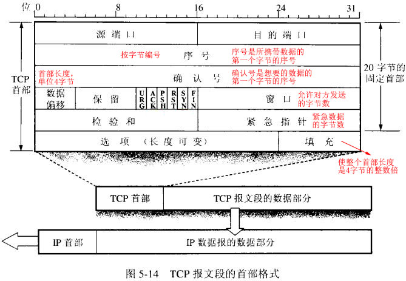

## 五、传输层

### 1.概述

传输层的功能：提供进程间的逻辑通信、复用与分用（使用端口地址区分进程）、差错控制。

#### 传输层寻址

传输层使用端口号区分不同的进程，并实现对网络层连接的复用。端口号长度为16位，能够表示65536个不同的端口号。其中0~1023是熟知的端口号，已经指派给了一些常用应用程序；1024~49151为登记端口，49152~65535为短临时端口。

比较常用的端口号：

| FTP  | TELENT | SMTP | DNS  | TFTP | HTTP | SNMP |
| :--: | :----: | :--: | :--: | :--: | :--: | :--: |
|  21  |   23   |  25  |  53  |  69  |  80  | 161  |

进程之间在网络中的通信使用**套接字**，为（主机IP地址，端口号）。

### 2.UDP协议

UDP只提供信道的复用和分用、差错控制。UDP无需建立连接，尽最大努力交付。

#### UDP 数据报

UDP首部包含2字节的源端口号、2字节的目的端口号、2字节的UDP长度、2字节的UDP校验和。

为计算校验和需要将UDP首部增加12字节的伪首部使其有16字节，伪首部包含4字节的源IP地址、4字节的目的IP地址、1字节全零、1字节的UDP协议号17、2字节的UDP长度。

校验和计算整个UDP数据报（伪首部、首部、数据），校验时先将校验和字段置零，将数据字段用零填充至偶数字节，按16位字的补码求和再求补码，放入校验和。如果不使用校验和，则该字段全零。

### 3.TCP协议

TCP协议是面向连接的协议，提供可靠的交付服务，保证数据无差错、不丢失、不重复、不失序。TCP是全双工的。

#### TCP报文段

- URG位：URG=于1时，紧急指针字段有效。

- ACK位：ACK=1时，确认号字段有效。

- PSH位：TCP接收到PSH=1的报文段，会尽快交付给进程。

- RST位：RST=1时，表明TCP连接严重错误，需要释放连接再重新建立。

- SYN位：SYN=1时，为连接请求报文或连接就收报文。

  当SYN=1、ACK=0时， 是一个连接请求报文，请求建立TCP连接；当SYN=1、ACK=1时，是一个连接接收报文。

- FIN位：终止位，当释放连接时FIN=1。

#### TCP 连接

###### TCP 连接的建立，称为三次握手。

- 客户机主动打开端口，发送连接请求报文，SYN=1，ACK =0，seq = x；
- 服务器收到请求后，如果同意连接，为此连接分配TCP 缓存和变量，发送连接确认报文，SYN=1，ACK=1，seq = y，ack =x+1；
- 客户机收到确认报文后，分配TCP缓存和变量，想服务器确认，SYN=0，ACK=1，seq=x+1，ack=y+1。

##### TCP连接的释放

- 客户机打算关闭连接，会发送一个连接释放报文，FIN=1，seq=u；服务器收到此报文，同意释放连接，发送确认，ACK=1，ack=u+1。此时只是客户机不再想服务器发送数据，并不影响服务器向客户机发送数据。
- 同样的，服务器打算关闭连接，也执行同样的步骤。

#### TCP可靠传输

- 报文段的序号保证数据有序。
- 确认机制保证报文段到达。
- 重传。当发生确认超时时，会触发重传；当收到3个对同一报文段的冗余ack时，说明后面的报文段丢失，触发快速重传。

#### TCP重传计时器

当发送方发送一个报文段，立即触发计时，若该报文段的确认时间R超过重传超时值RTO，则触发重传。RTO是一个动态的值，$\text{RTO} = \text{SRTT} + 4 \times \text{RTTVAR}$，其中SRTT为平滑往返时间，RTTVAR往返时间变化。

当一个报文段的确认时间没有超过RTO，则需要对RTO进行更新：

$$\text{SRTT} = \alpha \text{SRTT} + (1-\alpha) \text{R}$$

$$\text{RTTVAR}=\beta \text{RTTVAR} + (1-\beta) \mid \text{SRTT} - \text{R} \mid$$

$$\text{RTO} = \text{SRTT} + 4 \times \text{RTTVAR}$$

其中，$\alpha$通常取7/8，$\beta$通常取3/4。

Karn算法建议上述过程不更新重传段的时间，同时每次连续重传的超时间隔值加倍。

#### TCP流量控制

基于滑动窗口协议的流量控制机制，发送方根据接收方的接收窗口rwind和网络的拥塞窗口cwind中最小的，决定发送数据的多少。rwind由接收方的缓存决定，cwind由拥塞控制决定。TCP拥塞控制实际是维护cwind的大小。

#### TCP拥塞控制

拥塞控制是由发送方自己来实现控制的，自己维护cwind。而流量控制需要接收方反馈rwind。

- 慢启动算法：设置cwind=1，单位为最大报文长度；每收到一个报文段的确认，将cwind加1，实际表现为每经过RTT时间cwind翻倍；至达到慢启动阈值，切换至线性增加。
- 拥塞避免算法：即上述的线性增加，每经过一个RTT，cwind加1。
- 当网络出现拥塞时，即发生确认超时，将慢启动阈值设置为当前cwind的一半，cwind设置为1，重新开始慢启动算法和拥塞避免算法。
- 快重传机制：当发送方连续收到3个对同一报文段的冗余ACK，表明后面的报文段没有接收到，此时发送方不需要等到超时就对之后的报文段重传，称为快重传机制。
- 快恢复机制：当发送方连续收到3个对同一报文段的冗余ACK，慢启动阈值设定为当前cwind的一半，cwind设定为改变后的阈值，直接执行线性增加。