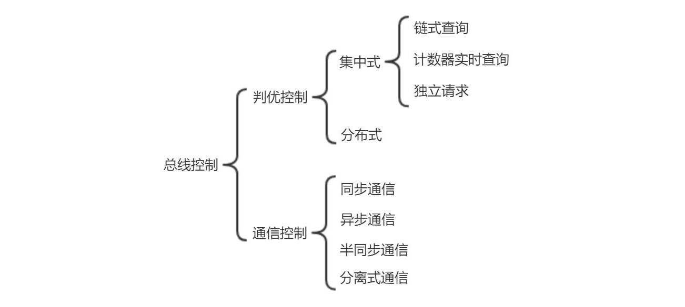

## 五、总线

### 1. 总线的基本概念

总线是连接多个部件的信息传输线，是各个部件共享的传输介质。

**分时和共享**是总线的两个特点，分时指同一时刻只允许一个设备向总线发送信息，共享指总线上可以挂载多个设备，分时共享总线。

#### 总线分类

总线按照数据传送方式可分为并行传输总线和串行传输总线。

按照连接部件的不同进行分类，可以分为**片内总线**（芯片内部的总线，连接寄存器、ALU 等）、**系统总线**（CPU、主存、I/O 设备之间的信息传输线）、**通信总线**（计算机系统之间、计算机与其他系统之间通信用的传输线）。

- 系统总线根据传输内容的不同又可分为**数据总线、地址总线、控制总线**。地址总线是单向传输的，数据总线是双向传输的。
- 通信总线种类很多，按传输方式可分为串行通信总线和并行通信总线。串行通信总线适用于远距离传输，减少架设成本；并行通信总线适用于近距离传输，通过并行提高数据传输速率。

#### 总线特性

- 机械特性：尺寸、形状
- 电气特性：电压
- 功能特性：每根传输线的功能
- 时间特性：任一条线在什么时间内是有效的

#### 总线的性能指标

- 总线宽度：指数据总线的根数，单位 bit。
- 总线带宽：总线的数据传输率，单位 MBps/Mbps、GBps/Gbps。
- 时钟同步/异步：总线上的数据与时钟同步工作的总线称为同步总线，与时钟不同步工作的称为异步总线。
- 总线周期：指一次总线操作所需的时间。总线的时钟周期与机器的时钟周期相同，一个总线周期包含多个时钟周期。
- 总线工作频率：总线周期的倒数。总线的时钟频率为时钟周期的倒数，若总线周期包含$N$个时钟周期，则总线工作频率$=$时钟频率$/N$。
- 总线复用：将地址总线和数据总线使用一条物理线路，分时地传输地址和数据。
- 信号线数：地址总线、数据总线、控制总线 3 种总线线数的和。
- 总线控制方式：突发工作、自动配置、仲裁方式、逻辑方式、计数方式等。
  - 突发工作/突发传输：在一个总线周期内传输存储地址连续的多个数据字的总线传输方式。
- 总线的负载能力：即驱动能力。

### 2. 总线标准

##### ISA

ISA 总线是最早出现的微型计算机总线，没有支持总线仲裁的硬件逻辑，需要花费 CPU 来对其控制。16 位。

##### EISA

EISA 总线在 ISA 上进行来扩展，支持 32 位，支持总线总控器而不需要 CPU 来进行控制。

##### VESA / VL-BUS

VESA 总线是一种 32 位的局部总线标准，通过局部总线控制器将高速 I/O 设备直接挂在 CPU 上。32 位/64 位

##### PCI

PCI 总线是目前 PC 中常用的总线之一，支持 32 位和 64 位，具有以下特点：

- 高性能（速率高），支持突发工作方式，提供数据和地址的奇偶校验。
- 与 CPU 的时钟频率无关，属于局部总线，支持不同结构的处理器；支持即插即用，兼容性好。
- 采用多路复用，接口数据线较少。

##### PCI-E

PCI-Express 是最新的总线和接口标准，将全面取代 PCI 和 AGP。

##### AGP

AGP（加速图形接口）总线为传输三维图形数据而产生，属于局部总线。采用“双激励”的传输技术，可以在时钟的上、下沿双向传递数据，以获取双倍的传输速率。

##### RS-232C

RS-232C 总线是一种串行通信总线标准（串口），应用于串行二进制交换的数据终端设备（DTE）和数据通信设备（DCE）。

##### USB

USB（通用串行总线）是目前 PC 中常用的总线之一，具有以下特点：

- 真正的即插即用，外设装置的驱动程序的安装、删除可自动实现；可连接的设备数量非常大。
- 数据传输率高，1.0 版为 1.5Mbps/12Mbps（在使用屏蔽双绞线是速率较高，达到 12Mbps），2.0 版为 480Mbps，3.0 版为 5Gbps，3.1 版为 10Gbps。
- 标准统一，各种外设装置都可以采用同样的接口。
- 生命力强，USB 规范没有专利版权，任何人都可以用。

##### PCMCIA

个人计算机存储器卡，即插即用。

##### IDE

更准确的称为 ATA，用于 IDE 接口的驱动器。

##### SATA

串行高级技术附件，一种基于行业标准的串行硬件驱动器接口。

##### SCSI

小型计算机系统接口，用于计算机和设备（硬盘、光驱、打印机）之间系统级接口的独立处理器标准。

### 3. 总线的结构

#### 单总线结构

CPU、主存、各 I/O 设备都连接在一条系统总线上。（I/O 设备通过不同的 I/O 接口连接到总线上）。结构简单，便于扩充；但是所有的传输都通过这一条总线，影响工作效率。多采用于一些小型系统。

#### 双总线结构

将速度较低的 I/O 设备从单总线上分离出来，增加一个管理 I/O 设备的部分（称为通道）。这样 CPU、主存、通道通过主存总线相连，通道与各 I/O 接口通过 I/O 总线相连，I/O 接口上挂载这各种 I/O 设备。

#### 三总线结构

一种三总线结构由以下三条总线构成：

1.  连接 CPU 和主存的主存总线
2.  连接 CPU 和各 I/O 接口的 I/O 总线
3.  连接主存和高速 I/O 接口的 DMA 总线

这种结构下任一时刻某个设备只能使用一条总线，例如主存不能同时使用主存总线和 DMA 总线。

### 4. 总线控制

总线控制器的功能主要包括判优控制（哪个设备由权利使用总线）和通信控制。

#### 总线判优控制

总线判优控制分为集中式和分布式两种。集中式将控制逻辑放在一处，如 CPU 中；分布式将控制逻辑分散在与总线连接的各个设备中。

集中式的总线判优控制，对各个设备优先权的仲裁方式有以下三种：

- 链式查询
- 计数器定时查询
- 独立请求

##### 链式查询

控制总线有 3 根线用于总线控制：BS 总线忙（总线是否在使用）、BR 总线请求（各设备是否请求使用总线）、BG 总线同意（同意获得总线使用权）。各设备的 BS、BR 是并联到总线控制器上的，而 BG 是串联到总线控制器上的。

当总线空闲，各设备收到 BS 线上总线空闲的信号，需要使用总线的设备通过 BR 线向总线控制器发送 BR 总线请求信号。总线控制器在总线准备好后发出 BG 信号，由于 BG 线在各设备间是串联的，因此在 BG 线上与总线控制器最近的设备会首先收到 BG 信号。若该设备需要使用总线（发出过 BR 信号），则不再向下传输 BG 信号，使用总线；否则向下设备传输 BG 信号。依次类推，各设备按照 BG 线上的排列顺序接收 BG 信号，因此离总线控制器越近的设备具有越高的优先级。

优点：结构简单，容易扩充，对故障敏感（因为有串联，若信号没有传到末尾但是又没有设备使用总线，就说明有故障）。

缺点：优先级低的设备很难获得总线的使用权。

##### 计数器定时查询

控制总线中除了 BS、BR 外还要一条设备地址线。设备地址线也是并联在各设备上，各设备的设备地址为预先分配的总线控制器的计数值，每个设备不相同。

当总线空闲，各设备收到 BS 信号后根据需求发出 BR 信号，总线控制器按照一定的时间间隔开始计数，同时将计数值通过设备地址线广播到各设备。若某个设备的设备地址与该计数值一致，并且是请求使用总线的，其获得总线使用权，此时总线控制器的计数也会停止；若该计数值对应的设备没有请求总线使用权，则继续计数。

若每次计数都是从“0”开始，则各设备的优先级按照设备地址$0, 1, 2, 3, \cdots$的顺序递减。若每次计算都是从上次计数的终止处开始，则各设备优先级相同。

优点：可以通过改变计数器的初始值来改变设备的优先级。

##### 独立请求方式

各设备有独立的 BS、BR 线，各设备可以独立的发送请求信号。总线控制器可以同时得知哪些设备请求总线，因此总线控制器有一个**排队电路**（也有可能是通过程序来控制排队）来决定同时请求总线的多个设备谁能获得总线使用权。

优点：响应速度快，灵活控制各设备的优先级。

缺点：控制线数量多，总线控制逻辑复杂。

#### 总线通信控制

完成一次总线操作称为总线周期，包含 4 各阶段：申请分配阶段（主设备申请总线的使用权）、寻址阶段（主设备发出本次总线传输的从设备的地址及有关命令）、传数阶段（主从设备交换数据）、结束阶段（主设备从总线撤除有关信息，让出总线使用权）。

总线通信方式通常有以下 4 种：同步通信、异步通信、半同步通信、分离式通信。

##### 同步通信

通信双方由同一时钟控制数据传输。时钟产生相同的总线周期（多个时钟周期为一个总线周期），各设备发送、接收信息都在固定的总线周期内。

优点：总线控制逻辑简单。

缺点：主从设备属于强制性同步，速率不同设备只能按照最慢速度进行，影响总线的数据传输率。

适用于总线长度短、各部件存取时间较一致的系统中。

##### 异步通信

没有公共的时钟标准，采用应答方式。主设备发出“请求”信号，经总线到达从设备，等待从设备反馈“响应”信号，主设备接到“回答”信号后才开始通信。

异步通信的应答方式可分为不互锁、半互锁、全互锁三种类型。

- 不互锁：主设备发出“请求”信号后，确认从设备已经收到了此“请求”信号就将其撤销；从设备发出"回答“信号后，确认主设备已经收到了此”回答“信号就将其撤销。这时主从设备间没有互锁关系，如 CPU 向主存写入信息。
- 半互锁：主设备发出”请求“信号后，必须等接收到从设备的”回答“信号后才撤销此”请求“信号；从设备发出”回答”信号后，只要确认主设备已经收到了此“回答”信号就将其撤销。这时主从设备间为半互锁关系，如多 CPU 系统，某一个 CPU 访问共享的存储器。
- 全互锁：主设备发出”请求“信号后，必须等接收到从设备的”回答“信号后才撤销此”请求“信号；从设备发出“回答”信号后，必须等主设备的“请求”撤销后才撤销此“回答”信号。这是主从设备间为全互锁关系，如网络通信。

##### 半同步通信

在同步通信中，从设备传输速率较低时，主设备在总线周期中的一些时钟周期发送“等待”，匹配从设备的较低的传输速率。此时主从设备并不是完全同步。

##### 分离式通信

主设备获得总线使用权之后将命令、地址、其他相关信息、主模块编号一并发送给从设备，从设备接收这些信息之后主设备让出总线使用权；从设备准备好主设备所需的数据之后申请总线使用权，获得总线使用权之后再将这些信息发给主设备。

这种通信方式将一个通信周期分成来两部分，使得在从设备准备数据这段时间内总线不是空闲等待，提高总线的利用率。缺点是控制复杂。
