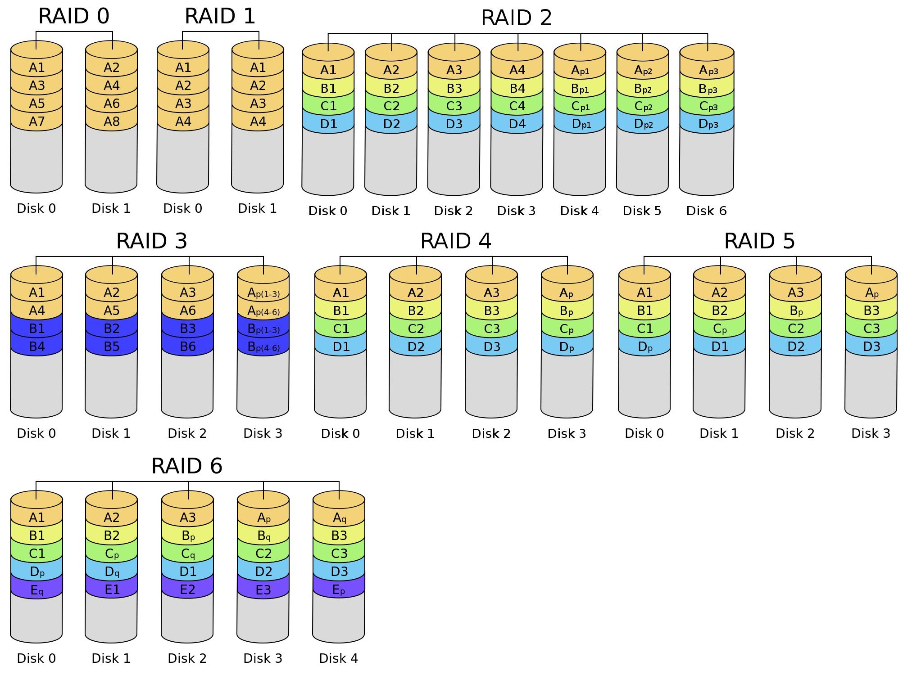

## 六、输入输出系统

**IO 操作尽量绕开 CPU 可以提高系统的整体运行效率。**

### 1. 概述

输入输出系统由 I/O 硬件和 I/O 软件两部分构成。

- I/O 软件：包括驱动程序、用户程序、管理程序、升级补丁等。通常采用 I/O 指令和通道指令实现 CPU 和 I/O 设备的信息交换。
- I/O 硬件：包括外部设备、设备控制器和接口、I/O 总线等。通过设备控制器来控制 I/O 设备的具体动作；通过 I/O 接口与主机相连。

输入输出系统的发展分 4 个阶段。本章主要着重于第 2 阶段。

- 早期阶段：I/O 设备直接与 CPU 相连。
- 接口模块和 DMA 阶段：I/O 设备通过总线与 CPU 连接，高速 I/O 设备与主存通过 DMA 总线相连。
- 具有通道结构的阶段：通道用于大型机中，可以看作一种从属于 CPU、具体特殊功能的处理器。
- 具有 I/O 处理机的阶段：I/O 处理机是一种基本独立于 CPU 的处理机。

I/O 设备的编址方式有以下两种。

- 统一编址：将 I/O 设备的地址看作存储器地址的一部分。
- 不统一编址：I/O 设备地址和存储器地址是分开的。

传送方式可分为并行传送、串行传送。

联络方式可分为立即响应式、异步工作采用应答信号联络、同步工作采用同步时标联络。

I/O 控制方式主要有 4 种，为程序查询方式、程序中断方式、DMA 方式、通道方式。

### 2. I/O 设备

I/O 设备大致可分为三类：人机交互设备、存储设备、机-机通信设备。人机交互设备可分为输入设备和输出设备两种。

#### 输入设备

##### 键盘

键盘用于输入指令和数据。键盘输入信息可分为 3 个步骤：

- 查出按下的是哪个键；
- 将该键翻译成 ASCII 码或者其他编码；
- 将编码输送给主机。

键盘在使用中会产生机械抖动，为防止形成误判，会在键盘的电路中增加防抖电路，或采用软件技术消除抖动。

##### 鼠标

鼠标是常用的定位输入设备，有机械式和光电式两种。

其他的输入设备还有触摸屏、光笔、数位板、摄像机等。

#### 输出设备

##### 显示器

显示器按照显示元件可分为阴极射线管（CRT）显示器、液晶显示器 LCD、LED 显示器等。按照所显示的信息内容分类，有字符显示器、图形显示器和图像显示器。主要有以下参数：屏幕大小、分辨率、刷新频率、灰度与色彩，以及显示存储器。

为了不断提供刷新图像的信号，必须把一幅图像的信息存储在显示存储器（刷新存储器）中。分辨率越高，灰度级越多，显示存储器容量越大。

- 阴极射线管 CRT：CRT 由电子枪、偏转线圈、荫罩、高压石墨电极和荧光粉涂层及外壳玻璃 5 部分组成。按扫描方式的不同，分为光栅扫描和随机扫描两种。
  - 字符显示器显示字符点阵和间隔，主要元件是字符发生器。
  - 图形显示器将一组坐标点和绘图命令组成的显示文件，通过矢量产生器使屏幕显示图像。为使显示的图像稳定，要对屏幕反复刷新。
- 液晶显示器 LCD：利用液晶的电光效应，由图像信号电压直接控制薄膜晶体管，再间接控制液晶分子的光学特性来实现图像的显示。
- LED 显示器（发光二极管）：由发光二极管组成屏幕，功耗更低。

##### 打印机

按工作原理分为击打式和非击打式两大类，按工作方式可分为点阵打印机、针式打印机、喷墨打印机、激光打印机等。

- 针式打印机：打印头上有多个钢针，在主机发出命令后，经接口、检测和控制电路，间歇驱动纵向送纸和横向移动打印机头，同时驱动打印机间歇冲击色带，在纸上打印出内容。擅长各种票据、蜡纸等的打印。
- 喷墨打印机：带电的喷墨雾点经过电极偏转后，直接在纸上形成所需字形。彩色喷墨打印机按比例混合 3 种基色来实现彩色打印。喷墨打印机可以实现高质量的彩色打印，速度比针式打印机快，但是防水性差。
- 激光打印机：信息经调制后的激光束扫描，在感光鼓上形成潜像，再经过显影、转印和定影，便在纸上得到所需的字符或图像。激光打印机打印质量高、速度快、噪声小、处理能力强，但是耗材多且价格昂贵，对纸张的要求高。

#### 外存储器

##### 磁盘存储器

磁盘存储器含有若干个记录面，每个记录面划分成若干条磁道而每条磁道又划分成若干个扇区，扇区是磁盘读写的最小单位，因此磁盘是按块存取的。每个记录面都有一个磁头相对应，用于读写记录面上的信息。不同记录面的相同编号的诸磁道构成一个柱面。

硬盘驱动器由磁盘驱动器、磁盘控制器和盘片组成。目前使用的可移动磁头固定盘片的磁盘存储器，称为温切斯特硬盘，简称温盘。磁盘控制器是存储器与主机的接口，主流的标准有 IDE\SCSI\SATA 等。

磁盘存储器的磁记录方式又称为编码方式，常用的有六种。

- 归零制 RZ：记录”1“时，用正向脉冲电流；记录”0“时，用反向脉冲电流。
- 不归零制 NRZ：见变就翻。遇到记录”01“或者”10“这种变化时就翻转脉冲电流。
- ”见 1 就翻“的不归零制 NRZ1：只有在记录“1”时电流翻转方向，记录“0”时电流方向保持不变。
- 调相制 PM：记录“0”时，电流方向由负变正；记录“1”时，电流方向由正变负。
- 调频制 FM：采用不同的频率记录，如记录“0”时只在周期结束时翻转一次电流方向，记录“1”时在周期内和周期结束时各翻转一次电流方向。
- 改进型调频制 MFM：记录“0”时，电流方向不进行任何翻转，记录“1”时，只在周期内翻转一次电流方向。

磁盘的性能指标包含容量、记录密度、平均存取时间、数据传输率。

- 容量：有非格式化容量和格式化容量之分。非格式化容量指磁记录面可以利用的磁化单元总数；格式化容量指按照某种特定的记录格式所能存储的信息的总量。
- 记录密度：指单位面积上能够记录的二进制的信息量。通常以道密度、位密度和面密度表示，道密度是沿磁盘半径方向上单位长度包含的磁道数，位密度是磁道单位长度上能记录的二进制位数，面密度是道密度和位密度的乘积。
- 平均存取时间：平均存取时间由寻道时间、旋转延迟时间和传输时间构成。
- 数据传输率：设磁盘转数为$r$，每条磁道容量为$N$字节，则数据传输率为$D = rN$。

磁盘的地址一般由驱动器号、柱面号（磁道号）、盘面号、扇区号组成。

##### 磁盘阵列

RAID（独立磁盘冗余阵列）是将多个独立的物理磁盘组成一个逻辑盘，数据在多个物理磁盘上分割交叉存储、并行访问，具有更好的存储性能、可靠性和安全性。

- RAID0：数据分段后分散存储多个磁盘中，读写时都并行处理。在所有的级别中，RAID 0 的速度是最快的，但无冗余和无校验的磁盘阵列，没有容错能力。
- RAID1：镜像磁盘阵列，即两个磁盘当作一个磁盘使用，互为备份，可靠性高。
- RAID2：采用纠错的海明码的磁盘阵列，将数据按比特分割存储在多个磁盘中，将海明码按比特存储在其它磁盘中。
- RAID3：位交叉奇偶校验的磁盘阵列，将数据按比特分割存储在多个磁盘中，校验码单独存放在一个磁盘中。
- RAID4：块交叉奇偶校验的磁盘阵列，将数据按块分割存储。
- RAID5：无独立校验的奇偶校验磁盘阵列，RAID0 和 RAID1 的折衷，校验位不是存放在单独的磁盘中，而是分布于所有的磁盘中。
- RAID6：在 RAID5 的基础上增加了第二种校验算法，即采用两套不同的校验码，可靠性更高。
- 上述方法可以混合使用，形成如 RAID10/01、RAID50、RAID53 等方法。

##### 光盘存储器

光盘存储器采用聚焦激光束对盘式介质以非接触的方式记录信息。一个完整的光盘存储器由光盘片、光盘驱动器、光盘控制器和光盘驱动软件组成，光盘片由透明的聚合物基片、铝合金反射层、漆膜保护层的固盘构成。

光盘存储器存储密度高、携带方便、成本低、容量大、容易保存等优点。

光盘存储器类型如下：

- CD-ROM：只读型光盘
- CD-R：只写一次光盘
- CD-RW：可读可写光盘
- DVD-ROM/R/RW：通用数字化多功能光盘
- BD：蓝光光盘

##### 固态硬盘

使用高性能的 Flash Memary 作为硬盘来记录数据。

### 3. I/O 接口

I/O 接口是主机和外部设备之间的交接界面，解决主机和外部设备之间的差异，实现主机和外部设备之间的信息交换。

#### I/O 接口的功能

- 实现主机和外设的通信联络控制，解决二者的时序配合问题。
- 进行地址译码和设备选择。
- 实现数据缓冲，消除速度差异。
- 进行信号格式的转换，如电平转换、并/串或串/并转换、数/模或模/数转换。
- 传送控制命令和状态信息。

I/O 接口的内部接口同系统总线相连，外部接口同外设相连。CPU 同外设之间的信息传送实际上是对接口中的某些寄存器进行读写操作。

#### I/O 接口的类型

按数据传送方式可分为并行接口、串行接口。按功能选择的灵活方式可分为可编程接口和不可编程接口。按主机访问 I/O 设备的控制方式可分为程序查询接口、中断接口和 DMA 接口。

#### I/O 端口

**I/O 端口指接口电路中可以被 CPU 直接访问的寄存器**，主要有数据端口、状态端口和控制端口，通常 CPU 对数据端口进行读写操作，对状态端口只进行读操作，对控制端口只进行写操作。

对 I/O 端口的编址方式有统一编址和独立编址两种。

##### 统一编址

统一编址又称存储器映射方式，是指把 I/O 端口当作存储器的单元进行地址分配

优点：这种方式下 CPU 不需要专门的 I/O 指令，用访存指令就可以访问这些 I/O 端口，更灵活方便，具有较大的编址空间。

缺点：端口占用存储器地址使内存容量变小，执行的速度较慢。

##### 独立编址

独立编址又称 I/O 映射方式，独立编址需要 CPU 设置专门的 I/O 指令才能访问 I/O 端口。

优点：I/O 指令与存储器指令有所区别，方便程序编制。

缺点：CPU 需要提供存储器读写、I/O 设备读写两组控制信号，增加了控制的复杂度。

### 4. I/O 控制方式

#### 程序查询方式

当主机进行 I/O 操作时，首先发出询问信号，读取设备的状态并根据设备状态决定下一步操作究竟是进行数据传送还是等待。

1.  CPU 执行初始化程序， 并预置传送参数；
2.  向 I/O 接口发出命令字，启动 I/O 设备；
3.  从 I/O 接口读取状态信息；
4.  **CPU 不断查询 I/O 设备状态，直到外设准备就绪**；
5.  传送一次数据；
6.  修改地址和计数器；
7.  若数据还没有传送完，转到第 3 步，直到数据全部传送结束。

这种控制方式下接口设计简单，但是 CPU 需要花费大量的时间用于查询和等待，效率很低。

#### 程序中断方式

计算机执行程序的过程中，出现异常情况和特殊请求时，计算机会停止当前程序的运行，转向对这些异常情况和特殊请求的处理，处理结束后在返回程序的间断处继续执行。

现代计算机的 CPU 处通常设有处理中断的机构。每个 I/O 接口上都配置有一个中断请求触发器 INTR，用于向 CPU 提起中断请求；I/O 接口上还配置有一个屏蔽触发器 MASK，因为 CPU 在瞬间只能接受一个中断请求，当 CPU 处理一个中断时 I/O 接口需要屏蔽其它外设的中断请求。为了对多个中断源进行排队，还设有排队器，速度越高的 I/O 设备，优先级越高。

##### 程序中断方式工作流程

1.  中断请求

    - 根据中断源的类型分为内中断和外中断，内中断是处理器和内存内部产生的中断，其他的是外中断。
    - 还可分为硬件中断、软件中断。**软件中断是内中断**。
    - 非屏蔽中断和屏蔽中断，非屏蔽中断允许 CPU 在处理中断的过程中接受其它的中断请求，中断发生嵌套；屏蔽中断则不允许这种情形发生。二者都是外中断。

2.  中断判优

    - 中断判优是通过硬件或者软件实现， 硬件实现是通过排队器，软件实现通过查询程序实现。
    - 硬件故障中断属于最高级，其次是软件中断；非屏蔽中断高于可屏蔽中断；DMA 请求高于 I/O 设备的中断请求；高速设备高于低速设备；输入设备高于输出设备；实时设备高于普通设备。

3.  CPU 响应中断的条件

    - 中断源有中断请求
    - CPU 允许中断及开中断（允许更高级的中断请求）
    - 一条指令执行完毕，且没有更紧迫的任务

4.  中断隐指令

    中断隐指令将 CPU 转到中断服务程序。完成如下操作：

    1.  关中断：执行中断服务程序的过程中不被新的中断打断，需要关闭中断。
    2.  保存断点：为了保证在中断服务程序执行完毕后能正确地返回到原来的程序，必须将原来程序的断点保存起来。
    3.  引出中断服务程序：取出中断服务程序的入口地址传送给程序计数器 PC。

5.  中断向量

    不同的设备有不同的中断服务程序，每个中断服务程序都有一个入口地址，CPU 必须找到这个**入口地址，即中断向量**。这些中断向量集中存放在存储器的某个区域内，称为**中断向量表**。

6.  中断处理过程

    1.  关中断，保存断点，引出中断服务程序。有两种方法寻址中断服务程序的入口地址：硬件向量法和软件查询法。
    2.  保存现场和屏蔽字，包括程序状态字、中断屏蔽寄存器和 CPU 中的某些寄存器。
    3.  开中断，此时允许更高级的中断请求得到响应，实现中断嵌套。
    4.  执行中断服务程序。
    5.  关中断，恢复现场和屏蔽字。
    6.  开中断，中断返回，返回原程序的断点处，继续执行原程序。

##### 多重中断和中断屏蔽技术

多重中断是指执行中断服务程序的过程中能够响应更高级的中断请求，中断屏蔽技术主要用于多重中断。

CPU 要具备多重中断的功能需要下列条件：

1.  在中断服务程序中提前设置开中断指令；
2.  优先级高的中断源有权中断优先级低的中断源。

每个中断源都有一个屏蔽触发器，所有的屏蔽触发器组合在一起构成一个屏蔽字寄存器，存有**屏蔽字**。

#### DMA 方式

DMA 方式是完全由硬件进行成组信息传送的控制方式，可以在外设和内存之间开辟一条直接数据通道，不在经过 CPU，不需要保护和恢复现场，降低了 CPU 的开销。适合用于磁盘存储器等大批量数据的传送，此时中断的作用仅用于故障和正常传送结束。

DMA 接口与主存之间有一条直接数据通路，不经过 CPU，因此也不必中断现行程序，I/O 与主机并行工作，程序和传送并行工作。CPU 需要参与的仅有 DMA 在传送开始前要通过程序进行预处理，结束后要通过中断方式进行后处理。

##### DMA 控制器（DMA 接口）的组成

当 I/O 设备需要进行数据传送时，通过 DMA 控制器向 CPU 提出 DMA 请求，CPU 响应后将让出系统总线，由 DMA 控制器接管总线并进行数据传送。DMA 能够确定传送数据的主存单位地址及长度，自动修改主存地址计数和主存长度计数。传送结束后，DMA 控制器向 CPU 报告 DMA 操作结束。

- 主存地址计数器：存放要交换数据的主存地址。
- 传送长度计数器：用来记录传送数据的长度，计数器溢出时，数据传送完毕，自动发中断请求信号。
- 数据缓冲寄存器：用于暂存每次传送的数据。
- DMA 请求触发器：每当 I/O 设备准备好数据后给出一个控制信号，使 DMA 请求触发器置位。
- ”控制/状态“逻辑：指定传送方向，修改传送参数，并对 DMA 请求信号和 CPU 响应信号进行协调和同步。
- 中断机构

##### DMA 的传送方式

I/O 设备和 CPU 同时访问主存时可能会发生冲突，为有效地使用主存，DMA 控制器和 CPU 通常采用以下 3 种方法使用主存。

- 停止 CPU 访问主存：DMA 接口向 CPU 发送一个信号要求 CPU 放弃地址线、数据线和有关控制线的使用权，DMA 使用总线传输数据。传输结束后通知 CPU 可以使用主存，把总线使用权归还给 CPU。
- DMA 和 CPU 交替访存：这种方式仅适用于 CPU 的工作周期比主存存取周期长的情况。将 CPU 的工作周期分成两个部分，一部分供 DMA 访存（因为 CPU 跟不上主存的速度，主存会有等待，等待的时间用于 DMA），一部分供 CPU 访存。
- 周期挪用：当 I/O 设备有了 DMA 请求时，有 3 种情况。
  - CPU 此时没有访存，不发生冲突。
  - CPU 此时正在访存，必须等此存取周期结束后，CPU 再让出总线占有。
  - CPU 和 I/O 设备同时请求访存，则 CPU 暂时放弃总线占有，I/O 设备挪用一个或几个存取周期。

##### DMA 的传送过程

1.  预处理

    CPU 测试 I/O 设备状态，设置 DMA 控制器中寄存器的初始值、设置传送方向、启动该设备等，然后 CPU 继续执行原来的程序。I/O 设备准备好后向 DMA 控制器发送 DMA 请求，DMA 控制器向 CPU 发送总线请求。

2.  数据传送

    DMA 控制器获得总线使用权后，开始传输数据（以字或块为单位），传送过程由 DMA 来控制。

3.  后处理

    传送结束后 DMA 控制器向 CPU 发送中断请求，CPU 执行中断服务程序做 DMA 结束处理，包括校验送入主存的数据是否正确、测试传送过程是否出错和决定是否继续使用 DMA 传送其它数据等。

##### DMA 方式与中断方式的区别

- 中断方式是程序的切换，需要保护和恢复现场；DMA 除了预处理和后处理，其它时间不占用 CPU 资源。
- 对中断请求的响应在每条指令执行结束后；对 DMA 的响应在可以在每个机器周期结束，只要 CPU 不占用总线即可。
- 中断传送过程需要 CPU 干预；DMA 方式的传送过程不需要 CPU 干预，由 DMA 硬件完成。
- DMA 请求的优先级高于中断请求。
