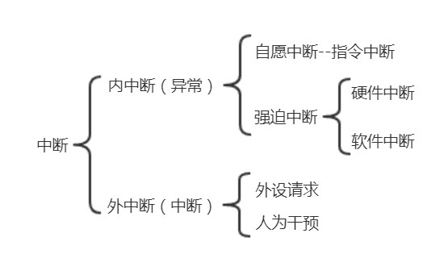

# 操作系统

## 一、操作系统概述

### 1. 基本概念

计算机系统自下而上可粗分为四个部分：硬件、操作系统、应用程序和用户。操作系统是指控制和管理整个计算机系统的硬件和软件资源，并合理地组织调度计算机的工作和资源的分配，以提供给用户和其它软件方便的接口和环境的程序集合。

#### 操作系统的基本特征

操作系统的基本特征包括并发、共享、虚拟和异步。最基本的特征是并发和共享。

- 并发是指两个或多个事件在**同一时间间隔内**发生（并行是指多个事件在同一时刻发生），操作系统的并发性是指计算机系统中同时存在多个运行着的程序。引入进程的目的是使程序能够并发执行，但微观上这些程序还是分时地交替执行，也即操作系统的并发性是通过分时得以实现的。
- 共享即资源共享，可分为互斥共享方式和同时访问方式。互斥共享如打印机，一段时间内允许一个进程访问该资源。同时共享是宏观上的同时，微观上仍是分时共享。
- 虚拟是指将一个物理实体变为若干个逻辑上的对应物。操作系统利用了多种虚拟技术，分别来实现虚拟处理器、虚拟内存和虚拟外部设备。可以归纳为两种：时分复用技术和空分复用技术。
- 异步是指进程的执行不是一贯到底，而是走走停停。

#### 操作系统的功能

操作系统应具备以下几个方面的功能：处理机管理（进程管理）、存储器管理、文件管理和设备管理，还必须向用户提供**接口**，以及**扩充机器**（隐藏硬件）。

- 处理机管理的主要功能有：进程控制、进程同步、进程通信、死锁处理、处理机调度等。
- 存储器管理的主要功能有：内存分配、地址映射、内存保护与共享、内存扩充等。
- 文件管理的主要功能有：文件存储空间的管理、目录管理、文件读写管理和保护等。
- 设备管理的主要功能有：缓冲管理、设备分配、设备处理、虚拟设备等。

操作系统提供的接口有两类：命令接口、程序接口。

- 命令接口：用户利用命令接口来组织和控制作业的执行。有两种控制方式：联机控制方式、脱机控制方式，对应地有联机控制接口、脱机控制接口。
  - 联机控制接口又称交互式命令接口，用于分时或实时系统，具备和用户交互的能力。
  - 脱机控制接口又称批处理命令接口，用于批处理系统，作业运行时用户不能干预。
- 程序接口：程序接口由一组系统调用命令组成，编程人员可以使用这些系统调用命令来请求操作系统为其提供服务。**系统调用命令简称系统调用**。如 trap（用户态转入内核态）、fork（创建进程）、execve（执行进程）、exit（结束进程）、read、write（读写文件）、mkdir、rmdir（目录）等等。

操作系统将裸机改造成功能更强、使用更方便的机器。通常把覆盖了软件的机器称为**扩充机器**，又称为虚拟机。

### 2.操作系统的发展和分类

操作系统的发展历程如下：

手工操作阶段$\rightarrow$脱机处理$\rightarrow$早期批处理（单道批处理）$\rightarrow$多道批处理$\rightarrow$分时操作系统$\rightarrow$实时操作系统$\rightarrow$网络操作系统$\rightarrow$分布式操作系统$\rightarrow$个人计算机操作系统。

此外还有嵌入式操作系统、服务器操作系统、多处理器操作系统等。

1.  手工操作阶段：所有的工作都需要人工干预，此阶段无操作系统。

2.  单道批处理系统：系统对作业的处理是成批进行的，但内存中始终只保持一道作业。主要特征有：自主性（自动装入下一道）、顺序性、单道性。

    单道批处理系统下，高速的 CPU 需要等待低速的 I/O 设备，资源利用率低。

3.  多道批处理系统：允许多个程序同时进入内存并交替在 CPU 中运行，从而尽量让系统处于忙的状态。主要特征有：多道、宏观上并行、微观上串行。

    多道批处理系统需要进行多个程序之间的切换和各种资源的调度，设计和实现都复杂很多。

4.  分时操作系统：把处理器的运行时间分成很短的时间片，轮流分配给各联机作业使用。主要特征有：同时性（或称多路性，允许多个终端同时使用）、交互性、独立性（用户之间独立）、及时性（用户请求在很短时间内获得响应）。

5.  实时操作系统：为了在某个时间限制内完成某项紧急任务，产生了实时操作系统。分为硬实时系统和软实时系统，硬实时系统如飞机的控制系统、导弹制导系统等，指令必须实时执行；软实时系统允许偶尔违反时间限制，如飞机订票系统、银行管理系统等。

6.  网络操作系统和分布式操作系统：网络操作系统实现计算机之间的数据传送，分布式操作系统则是协同若干台计算机完成同一任务。

7.  个人计算机操作系统：Windows、Linux 和 MacOS 等。

### 3.操作系统的运行环境

操作系统划分了用户态（目态）和核心态（管态），核心态时运行操作系统内核程序，用户态时运行用户自编程序或系统外层程序，一些特权指令被禁止，如置中断指令、送程序状态字到程序状态字寄存器等。

用户态转向核心态的例子：

- 系统调用
- 中断
- 用户程序产生一个错误状态
- 用户程序企图执行一条特权指令

从核心态转向用户态由一条指令实现，该指令也是特权指令，一般是中断返回指令。而用户态转向核心态时用到的**访管指令**（自动放弃 CPU 的使用权），不是特权指令。

操作系统**内核**包含一些与硬件关联紧密的模块、运行频率较高的程序（进程管理、存储器管理和设备管理等），这部分内容都工作在核心态。核心态指令实际上包括系统调用指令和一些针对对时钟、中断、原语的操作指令。

#### 系统调用

在用户程序中，凡是与资源有关的操作，都必须通过系统调用方式向操作系统提出服务请求，并由操作系统代为完成。系统调用都运行在核心态。系统调用按功能可分为：设备管理、文件管理、进程管理、进程通信、内存管理。

#### 时钟管理

时钟的功能：计时、通过时钟中断实现进程切换。在分时操作系统中，采用时间片轮转调度来实现进程切换；实时系统中，按截止时间控制运行来实现进程切换；皮处理系统中，通过时钟管理来衡量一个作业的运行程度。

#### 中断机制

现代操作系统是靠中断驱动的软件。CPU 由用户态进入核心态的唯一途径是通过中断和异常实现。异常又称为内中断、例外或陷入（trap）。

#### 原语

原语是内核的组成部分，用于系统中的设备驱动、CPU 切换、进程通信等。原语程序不可中断，直接方法是关中断。

### 4. 大内核与微内核

随着体系结构和应用需求的不断发展，操作系统内核越来越大，内核代码维护难度增加，提出了微内核的体系结构。微内核有效分离了内核与服务、服务与服务，维护的代价降低。但微内核需要频繁切换核心态和用户态，增加了操作系统的开销。
